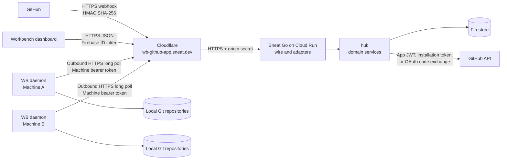
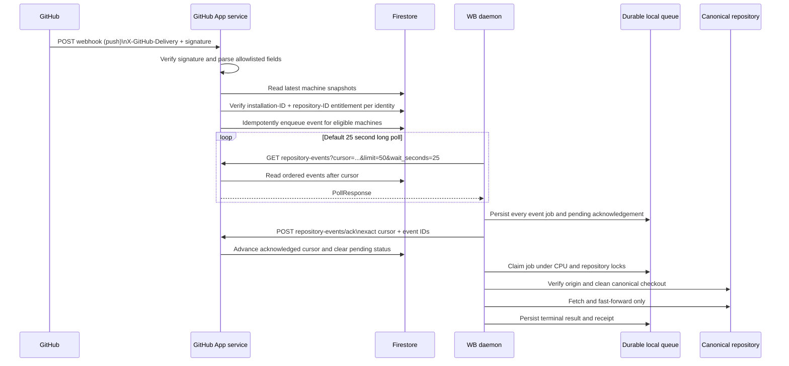
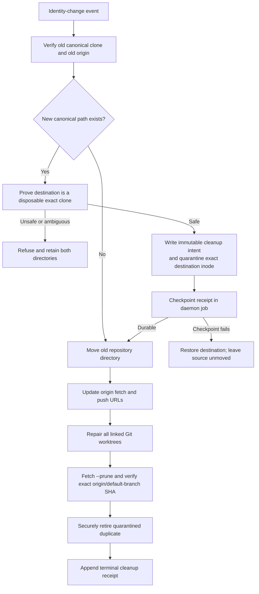

# Sneat Workbench GitHub App architecture

## Purpose

The Sneat Workbench GitHub App turns GitHub repository changes into safe,
durable work for registered WB daemons. Its first operational use is simple:
when a repository's default branch advances, each registered machine that has
that repository can fast-forward its clean canonical clone without performing
a fleet-wide scan.

The hosted service never opens a connection to a developer machine. Every WB
daemon makes an outbound HTTPS long-poll request. This works behind NAT, home
routers, VM firewalls, and corporate networks and uses the same protocol on
macOS, Linux, and Windows.

## Ownership and deployment

| Component | Repository | Responsibility |
| --- | --- | --- |
| WB CLI and daemon | `sneat-dev/wb` | Public wire DTOs and HTTP client, machine snapshot production, durable local queue, Git operations, throttling, receipts, retry and recovery |
| Workbench GitHub App | `sneat-dev/wb/hub` | Installation and OAuth journeys, entitlement checks, webhook translation, machine enrollment, event delivery and acknowledgement contracts |
| Cloud Run host | `sneat-co/sneat-go` | Route mounting, configuration, secrets, Firebase identity adapter, Firestore adapters, GitHub API transports |
| Web dashboard | `sneat-dev/workbench-web` | User-facing connection, machine, delivery and repository status |

The public control-plane origin is `https://wb-github-app.sneat.dev`. Cloudflare
terminates the public connection and forwards the request to the existing
Sneat Go Cloud Run service. The browser dashboard is
`https://sneat.work/bench/dashboard/github/`.



## Trust boundaries and credentials

The system uses a different credential at each boundary. Credentials are never
placed in event JSON, logs, command arguments, machine snapshots, or dashboard
projections.

| Boundary | Authentication | Server-side proof |
| --- | --- | --- |
| GitHub webhook to App | `X-Hub-Signature-256: sha256=<hex>` | Constant-time HMAC SHA-256 over the exact request bytes using the webhook secret |
| Dashboard to App | `Authorization: Bearer <Firebase ID token>` | Firebase token verification produces the stable Workbench identity ID |
| WB daemon to App | `Authorization: Bearer <opaque machine token>` | Lookup by a peppered SHA-256 digest binds one identity, machine ID and scope set |
| App to GitHub REST API | GitHub App JWT, installation token, or OAuth access token | GitHub verifies the relevant App, installation, or GitHub user |
| Cloudflare to Cloud Run | `X-Workbench-Origin-Secret` plus the expected forwarded host | Constant-time secret comparison and exact host allowlist |

Webhook construction rejects secrets shorter than 32 bytes. The webhook body
reader is bounded at GitHub's documented 25 MiB maximum and computes the HMAC
over the exact bytes that are subsequently translated.

Machine enrollment returns a high-entropy opaque token once. The service stores
only its peppered digest. Re-enrolling the same machine rotates the previous
credential. Machine credentials have separate scopes for snapshot publication,
snapshot reads, repository-event polling, and acknowledgement.

An installation URL is not authorization evidence because it can be forwarded.
The connection journey therefore binds GitHub access to the signed-in Workbench
identity:

```mermaid
sequenceDiagram
    actor U as User
    participant W as Workbench dashboard
    participant A as GitHub App service
    participant G as GitHub
    participant F as Firestore

    U->>W: Connect GitHub
    W->>A: POST /github/installations/connect\nFirebase bearer token
    A->>F: Store one-time bootstrap state\nidentity + expiry
    A-->>W: provider-origin connect_url + expires_at\n(no cross-site cookie)
    W->>A: Open top-level wb-github-app.sneat.dev page\nwith an inert flow locator
    A->>F: Atomically attach one-time opener challenge digest
    A-->>W: Set HttpOnly challenge cookie; page postMessages\nchallenge only to https://sneat.work opener
    W->>A: POST /github/installations/authorize\nchallenge + Firebase bearer token
    A->>F: Verify exact initiating identity and atomically authorize challenge
    W-->>A: postMessage authorization result\nfrom exact opener origin and window
    A->>F: Reload with challenge cookie; atomically consume bootstrap\nand store setup state + browser nonce digest
    A-->>W: Set Secure HttpOnly SameSite=Lax continuation cookie\nand 303 to GitHub
    W->>G: Follow redirect to GitHub App installation URL
    G->>A: GET /github/installations/setup\ninstallation_id + state + browser cookie
    A->>G: Verify installation with App credentials
    A->>F: Atomically consume setup state\nand store OAuth state
    A-->>G: 303 to GitHub OAuth authorization
    G->>A: GET /github/installations/callback\ncode + state + browser cookie
    A->>G: Exchange single-use code
    A-->>U: Set encrypted HttpOnly credential cookie\nand 303 to callback without code
    U->>A: GET callback\nstate + both cookies
    A->>F: Atomically stage encrypted access token in OAuth state
    A->>G: Read user, installations and repositories\n(recover staged token on retry)
    A->>F: Atomically consume staged OAuth state and upsert\nonly the explicitly connected installation
    A-->>U: Clear browser-continuation cookie
    A-->>U: 303 to /bench/dashboard/github/
```

The cross-site dashboard response never attempts to set the continuation
cookie. It returns a random flow locator on the dedicated
`wb-github-app.sneat.dev` origin. Possession of that URL grants no authority.
The top-level page creates a one-time challenge and sends it only to an opener
whose origin is exactly `https://sneat.work`. That opener authorizes the
challenge through the existing Firebase-authenticated CORS endpoint. The
provider accepts only the initiating Workbench identity, exact unexpired
challenge, challenged browser cookie, and one durable authorization. A browser
with no opener, a wrong-origin opener, or a forwarded URL remains inert. No
Firebase token, reusable secret, or other bearer credential appears in a URL.
Only after authorization does the provider set the continuation cookie and
redirect to GitHub. Later forwarded callback URLs do not carry the browser
nonce; durable setup and OAuth state stores only its SHA-256 digest.

The single-use OAuth code is exchanged once. The resulting access token is
AES-GCM encrypted with a key derived from the state secret and returned to the
same browser in a second Secure, HttpOnly, SameSite=Lax cookie. A self-redirect
removes the code from the URL, then atomically stages the encrypted token in the
OAuth state before user, installation, repository, or binding work continues.
If that store call fails, the browser cookie retains retry authority. Later
retries read the staged credential instead of exchanging the code again.
Terminal success atomically consumes the staged state and clears both cookies,
preventing replay.

The installation ID plus the repository's stable GitHub numeric ID is the
entitlement key. Repository owner/name is used for routing and display. A rename
or organization transfer therefore does not silently grant access and does not
invalidate an existing authorized repository.

## Direction and protocols

All public communication uses HTTPS with UTF-8 JSON (`application/json`). The
daemon uses request/response long polling rather than an inbound webhook,
WebSocket, gRPC stream, or public listener. This keeps machine setup small and
avoids exposing a laptop or VM through a tunnel.

The CLI communicates with its local WB daemon through WB's protected local
transport. On Unix this is a local socket; WB also has an authenticated,
generation-fenced file bridge for harnesses that cannot reach the socket.
Windows uses the WB local transport implementation available on that host.
Those local transports do not cross the hosted trust boundary: only the daemon
speaks HTTPS to the GitHub App service.

| Method and path | Caller | Authentication | Purpose |
| --- | --- | --- | --- |
| `POST /v0/workbench/machines/enroll` | Dashboard/CLI enrollment journey | Firebase bearer | Issue or rotate one machine credential |
| `POST /v0/workbench/machines/snapshot` | WB daemon | Machine bearer, snapshot-publish scope | Publish the complete privacy-safe repository/worktree allowlist |
| `GET /v0/workbench/machines/snapshot` | WB client | Machine bearer, snapshot-read scope | Read this identity's hosted machine snapshots |
| `GET /v0/workbench/repository-events` | WB daemon | Machine bearer, events-poll scope | Long poll an ordered event batch |
| `POST /v0/workbench/repository-events/ack` | WB daemon | Machine bearer, events-ack scope | Acknowledge the exact durably-enqueued batch |
| `POST /v0/workbench/github/webhook` | GitHub | Webhook HMAC | Accept supported GitHub deliveries |
| `POST /v0/workbench/github/installations/connect` | Dashboard | Firebase bearer | Start installation or reconnect OAuth |
| `GET /v0/workbench/github/installations/continue` | Top-level provider popup | Inert flow locator plus one-time challenged-browser cookie | Issue the opener challenge or, after authorization, establish the continuation cookie and redirect to GitHub |
| `POST /v0/workbench/github/installations/authorize` | Dashboard opener at `https://sneat.work` | Firebase bearer plus exact one-time challenge | Authorize the challenge only for the initiating Workbench identity |
| `GET /v0/workbench/github/installations/setup` | GitHub redirect | Single-use signed state plus browser-continuation cookie | Bind a verified installation to the initiating identity journey |
| `GET /v0/workbench/github/installations/callback` | GitHub redirect | Single-use signed OAuth state plus browser-continuation cookie | Verify the exact GitHub user can access the explicitly selected installation |
| `GET /v0/workbench/github/status` | Dashboard | Firebase bearer | Read connection, installation, machine, delivery, queue and error status |

## Default-branch update delivery



The hosted service routes an event only when both conditions are true:

1. the latest authenticated machine snapshot says that machine has the
   repository; and
2. the machine's Workbench identity has an active OAuth-verified entitlement
   for the webhook's exact installation ID and stable GitHub repository ID.

Signed `installation` suspend/delete, `installation_repositories` removed,
organization-membership removal, `github_app_authorization` revoked, and
repository `member` removed deliveries revoke the affected installation,
repository, or GitHub user's entitlements before the webhook request succeeds.
Add and unsuspend events do not grant access; they require explicit OAuth
revalidation, so missed or reordered positive events cannot reopen a stale
entitlement.

The snapshot is a routing allowlist, not authorization. It deliberately omits
filesystem paths, credentials, prompts, command output and local diagnostics.

## Wire format

The repository-event contract is explicitly versioned. Cursors and event IDs
are opaque to the daemon and must be replayed exactly.

Example long-poll request:

```http
GET /v0/workbench/repository-events?cursor=c_1042&limit=50&wait_seconds=25 HTTP/1.1
Host: wb-github-app.sneat.dev
Accept: application/json
Authorization: Bearer <machine-token>
```

Example response:

```json
{
  "version": 1,
  "cursor": "c_1042",
  "next_cursor": "c_1043",
  "events": [
    {
      "version": 1,
      "id": "9d24d89e-6ea5-4d15-a2c7-2d65950109be:default",
      "repository": "github.com/sneat-dev/workbench-web",
      "ref": "refs/heads/main",
      "reason": "default_branch_updated",
      "target_sha": "ca01b0ceff926cd5af5ca8a519ff3953afea69d6",
      "occurred_at": "2026-09-06T19:00:00Z"
    }
  ]
}
```

The daemon first writes every event into its durable local queue and writes a
pending acknowledgement. Only then does it acknowledge the batch:

```json
{
  "version": 1,
  "cursor": "c_1043",
  "event_ids": [
    "9d24d89e-6ea5-4d15-a2c7-2d65950109be:default"
  ]
}
```

The response echoes the accepted contract version and cursor:

```json
{
  "version": 1,
  "cursor": "c_1043"
}
```

Repository rename and transfer use the same event envelope:

```json
{
  "version": 1,
  "id": "4c438a6b-7470-4a9c-8a36-7a4543d554d9:renamed",
  "repository": "github.com/sneat-dev/workbench-web",
  "previous_repository": "github.com/sneat-co/workbench-web",
  "ref": "refs/heads/main",
  "reason": "repository_renamed"
}
```

GitHub sends `repository.renamed` and `repository.transferred` as distinct
webhook actions. The App translates both into the public identity-change event
without forwarding the original webhook payload, installation ID, sender, or
other private metadata.

## Local execution and throttling

The daemon persists jobs below the projects root in
`.wb/runtime/daemon/repository-events/`. The cursor, pending acknowledgement,
queued jobs, attempts, retry time, progress, transfer-cleanup receipt and
recovery command survive process and machine restarts.

WB runs independent repositories in parallel but serializes Git writers for
the same canonical repository. Repository transfer claims both the old and new
repository aliases so a push before a rename and a push after it cannot be
reordered. Burst pushes for the same repository/ref may be coalesced after the
last rename barrier; superseded job records remain auditable.

CPU-intensive work uses WB's shared cross-process admission budget:

```text
max concurrent admitted units = max(1, logical CPU count - 1)
```

This leaves one logical CPU for the harness and operating system. A four-vCPU
VM therefore admits at most three units across WB-managed work, including work
started by different agents.

## Rename and organization-transfer recovery

A GitHub identity-change event causes WB to reconcile the whole canonical
repository directory rather than cloning another copy:



WB never force-pushes, resets, stashes, or guesses through a dirty or ambiguous
state. The source move, both `origin` URLs, linked-worktree administration and
the exact fetched default-branch SHA are verified as one operation. If cleanup
is interrupted, the daemon job contains the exact immutable receipt and resumes
`wb repo transfer cleanup`; it does not rediscover deletion authority from a
directory name.

## Delivery guarantees and failure behavior

The contract provides at-least-once delivery with idempotent effects:

- GitHub may retry a delivery. The hosted event marker deduplicates its stable
  delivery-derived event ID.
- A poll response is not acknowledged until every event is durably queued on
  the machine.
- If acknowledgement succeeds but the local cursor write is interrupted, the
  pending acknowledgement is replayed exactly after restart.
- Local queue enqueue deduplicates event IDs, so replaying an unacknowledged
  batch is safe.
- HTTP `429`, `502`, `503`, and `504` responses receive bounded retry with
  context-aware backoff. Permanent failures return to the daemon loop.
- Long-running receiver and queue activity emits progress at least every ten
  seconds.
- A dirty checkout, unexpected branch, changed origin, divergent history,
  ambiguous transfer destination, or target-SHA mismatch is retained and
  reported. WB does not overwrite local work.

The event acknowledgement means the daemon has durably accepted the work. It
does not claim that Git synchronization has already succeeded. Hosted status
therefore distinguishes received, acknowledged, pending refresh and error
states.

## Privacy and observability

Hosted snapshots and events are allowlisted projections. They may contain a
machine name, canonical repository identity, worktree task/branch/lifecycle,
pull-request link, supported attention state, event reason, target ref/SHA and
timestamps. They do not contain local paths, source content, prompts, commit
messages, raw webhook bodies, access tokens, command lines or command output.

Human terminal output is concise and styled when interactive. Non-interactive
text remains aligned and readable in workflow logs. Stable machine interfaces
use JSON with an explicit contract version; `--format=json` is canonical and
`--json` is its shortcut where the CLI exposes both.

## Current MVP boundary

The current event path supports:

- default-branch `push` deliveries;
- repository `renamed` deliveries;
- repository `transferred` deliveries;
- machine enrollment and credential rotation;
- privacy-safe machine snapshots;
- installation plus user-OAuth entitlement verification;
- fail-closed installation, repository-removal and membership lifecycle handling;
- durable long polling, exact acknowledgement and local retry;
- clean fast-forward, safe repository-directory transfer and linked-worktree
  repair.

The MVP does not require inbound daemon connectivity, a Cloudflare Tunnel on a
developer machine, gRPC, WebSockets, or background fleet scanning for every
push. A periodic low-frequency reconciliation scan remains useful as a repair
mechanism for missed configuration, expired credentials, unsupported GitHub
events, or machines that were offline beyond hosted event retention.
