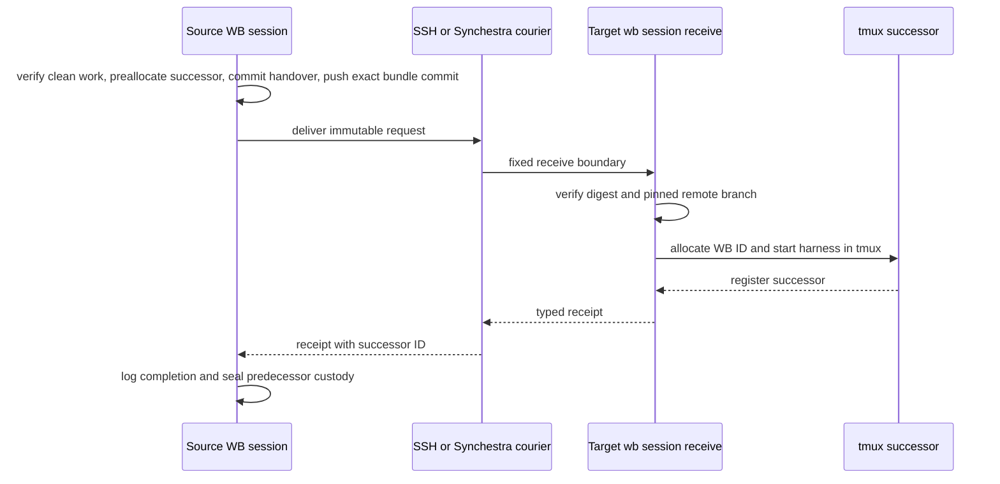

# Feature: Agent Session Move

> [SpecScore.**Studio**](https://specscore.studio): | [Explore](https://specscore.studio/app/github.com/sneat-dev/wb/spec/features/agent-session-move?op=explore) | [Edit](https://specscore.studio/app/github.com/sneat-dev/wb/spec/features/agent-session-move?op=edit) | [Ask question](https://specscore.studio/app/github.com/sneat-dev/wb/spec/features/agent-session-move?op=ask) | [Request change](https://specscore.studio/app/github.com/sneat-dev/wb/spec/features/agent-session-move?op=request-change) |
**Status:** Approved
**Source Ideas:** —
**Supersedes:** —
**Grade:** B

## Summary

Move an active AI agent session to another WB machine through an interchangeable courier while preserving Git state, handover context, lineage, and Work Log evidence.

## Problem

An agent session is currently tied to one harness process and one machine. A
developer who leaves a laptop and continues on a VM must manually remember the
branch, push it, reconstruct intent, open the correct checkout, start the right
harness, and explain the work again. Existing WB session records are local PID
registrations, and the existing Work Log handoff applies a source-local claim
transfer immediately; neither is a safe cross-machine transfer protocol.

WB needs to own the portable package and chain of custody while treating SSH
and Synchestra as interchangeable couriers. A failed delivery must never make
the source session appear transferred, and a retry must never start a second
successor for the same handoff.

## Behavior

### Session and target identity

#### REQ: stable-wb-session-identity

Every newly registered session MUST have a stable WB session ID independent of
its PID, tmux name, native harness session ID, and Synchestra invocation ID.
Session records MUST retain the machine, runtime, model, optional native
harness ID, optional tmux name, predecessor WB session ID, and handoff ID.
Existing PID-only records MUST remain readable.

#### REQ: exec-safe-session-registration

`wb session register` MUST refuse WB's own PID and a declared PID whose
authoritative process evidence identifies an intermediate shell or wrapper.
When a shell tail-execs the final WB command, registration MAY name the
process that is WB's direct parent only when authoritative process evidence
matches the declared harness runtime and role. For Codex, that evidence MUST
identify the `codex` executable basename and the exact `app-server` role
argument; nested configuration paths or script names MUST NOT affect the
classification. The command documentation MUST include a shell-safe form
that keeps the intermediate shell alive for older WB builds.

#### REQ: session-target-configuration

Cross-machine targets MUST be keyed by WB machine name and MUST keep courier
addresses separate from machine identity. The canonical configuration shape is:

```yaml
session_move:
  targets:
    hetzner-vm1:
      default_courier: ssh
      ssh:
        host: hetzner-vm1
        wb_path: /home/ai/go/bin/wb
      synchestra:
        runner: hetzner-vm1
```

The SSH host for the VM is `hetzner-vm1`; `vm` MAY remain a user shell alias
but MUST NOT be persisted as the canonical WB target or SSH host value.
`ssh.wb_path` MAY name a trusted configured absolute target executable when WB
is not on the non-login SSH path. Host and executable configuration MUST reject
option-like or whitespace-bearing values.

### Source checkpoint and portable handoff

#### REQ: exact-pushed-source-checkpoint

`wb session move --to <machine>` MUST resolve the live registered session that
owns the invoking process and a managed Git worktree with an active Work Log on
a named branch. It MUST refuse a dirty worktree, detached HEAD, missing remote,
push rejection, or any case in which the final handoff commit is not the remote
branch tip after a non-force push. WB MUST NOT stage or commit arbitrary user
changes; the invoking agent is responsible for making a coherent clean commit
before requesting the move. After that preflight WB MAY create one generated
handoff commit that stages only the handover path, then MUST push and verify the
exact remote tip.

#### REQ: portable-handoff-bundle

Before delivery, WB MUST preallocate the successor WB session ID and create an
immutable versioned handover at `.wb/handoffs/<handoff-id>.md` on the project
branch. The tracked document MUST identify the handoff, preallocated successor
ID, source and target machines, predecessor WB session, runtime/model/native ID
when known, repository remote, branch, source work commit, requested harness,
Work Log reference, summary, validation evidence, and remaining work. WB MUST
commit only that generated path and push the resulting bundle commit. A
machine-readable request and append-only phase state MUST live under
`<WB_HOME>/handoffs/<handoff-id>/` and carry the final bundle commit, document
path, and digest without trying to embed the self-referential bundle commit in
the document itself. The command MUST accept agent-authored handover content
from a file or stdin and MUST refuse an empty handover. Secrets and environment
dumps MUST NOT be included automatically.

### Courier boundary and target receipt

#### REQ: interchangeable-couriers

WB MUST expose one courier interface that delivers a versioned request and
returns a typed receipt. The MVP MUST provide `ssh` and `synchestra` couriers.
`--via` selects one explicitly; otherwise the target's `default_courier` is
used. A courier MUST NOT own Git checkpointing, bundle semantics, session
identity, Work Log transitions, or harness selection, and WB MUST NOT silently
fall back to a second courier after an ambiguous delivery failure.

#### REQ: fixed-target-receiver

Every courier MUST invoke the same fixed `wb session receive` boundary on the
target with the bundle bytes and digest; no request field may become an
arbitrary remote shell command. Receive MUST be idempotent by handoff ID and
digest. A repeated identical request MUST return the existing receipt, while a
reused ID with different bytes MUST fail.

#### REQ: pinned-target-worktree

The target receiver MUST fetch or clone the repository into the configured
projects root, verify that the remote branch tip still equals the request's
exact bundle commit, verify that the declared source work commit is its
ancestor, and create or reuse an isolated clean worktree pinned to the bundle
commit. It MUST refuse a moved branch, conflicting local worktree, dirty reuse
candidate, missing commit, or repository identity mismatch.

### Successor startup and custody

#### REQ: tmux-successor-start

The receiver MUST use the preallocated successor WB session ID and start the
successor through fixed argv in a detached, predictably named tmux session
rooted in the pinned worktree. The default harness MUST be the source runtime;
an explicit `--harness` override MUST permit a supported cross-harness move.
The fresh successor MUST receive the tracked handover document path in its
initial prompt and register its PID, WB session ID, tmux name, runtime, model,
and native harness ID when the harness exposes one.

#### REQ: receipt-records-lineage

The target MUST durably write a receipt containing the handoff ID, successor
WB session ID, predecessor WB session ID, target machine, tmux name, runtime,
optional native harness ID, pinned commit, and start time before reporting
success. WB MUST copy that receipt into the source handoff aggregate so the new
session can be addressed later.

#### REQ: receipt-gated-custody

The source session MUST retain ownership until a valid target receipt proves
that the successor was registered. Source and target Work Logs MUST record
linked requested, received, completed, or failed events with the handoff ID.
Only a valid receipt may seal the predecessor's claim as handed off; the
existing source-local applied handoff path MUST NOT be used for this transfer.

### Follow-up messaging

#### REQ: successor-messaging

`wb session send <wb-session-id>` MUST deliver a durable typed message through
the courier recorded in the handoff receipt, append it to the target session's
inbox, and safely paste it into the recorded tmux session without interpreting
message text as shell syntax. `wb session request-handoff <wb-session-id>` MUST
send the standard typed request to hand control back, preserving the lineage
and reply target. Delivery MUST return a message receipt or an actionable
failure.

### Failure and optimization boundaries

#### REQ: failure-is-recoverable

Every phase MUST be retryable from the durable handoff aggregate. Failure
before a successor receipt MUST leave the source active and MUST record the
last safe phase and diagnostic. Cancellation or retry MUST never create two
live successors for one handoff.

#### REQ: portable-baseline-before-native-resume

The MVP MUST start a fresh harness session from the portable handover for both
same-harness and cross-harness moves. Harness-native Codex-to-Codex or
Claude-to-Claude transcript resume MAY be added later behind the same courier
and receipt contract, but native resume and Claude Remote Control are not part
of this Feature.

## Architecture



WB owns the bundle, Git checkpoint, stable IDs, lineage, receiver, harness
adapters, message protocol, and Work Log transitions. Couriers implement only
delivery and receipt transport. The request is immutable; phase records,
receipts, and messages are append-only children of the handoff aggregate.

## Acceptance Criteria

### AC: ssh-move-starts-same-harness-successor

**Requirements:** agent-session-move#req:stable-wb-session-identity, agent-session-move#req:session-target-configuration, agent-session-move#req:exact-pushed-source-checkpoint, agent-session-move#req:portable-handoff-bundle, agent-session-move#req:interchangeable-couriers, agent-session-move#req:fixed-target-receiver, agent-session-move#req:pinned-target-worktree, agent-session-move#req:tmux-successor-start

Scenario: Move a registered session through SSH
Given a clean managed named branch whose exact handoff commit can be pushed and a target `hetzner-vm1` configured with `ssh.host: hetzner-vm1`
When the registered source agent runs `wb session move --to hetzner-vm1 --via ssh` with a non-empty handover
Then the target checks out the exact pushed commit in an isolated worktree and starts one detached tmux successor using the source harness with the handover path in its initial prompt

### AC: exec-safe-session-registration

**Requirements:** agent-session-move#req:stable-wb-session-identity,
agent-session-move#req:exec-safe-session-registration

Scenario: Register a tail-exec Codex app-server
Given WB is launched as the final command of a shell and the requested PID is
the live Codex app-server parent
When the process evidence identifies executable basename `codex` and exact role
`app-server`, even with nested MCP script paths in its arguments
Then `wb session register` records the requested harness PID

Scenario: Refuse an intermediate shell or WB self-registration
Given the requested PID is the shell that launched WB or WB's own PID
When `wb session register` is invoked
Then WB refuses before writing a session record and explains the safe `$PPID`
registration form

### AC: explicit-cross-harness-move

**Requirements:** agent-session-move#req:tmux-successor-start, agent-session-move#req:portable-baseline-before-native-resume

Scenario: Override the source harness
Given a supported source runtime and a target with a different supported harness installed
When the source requests the target harness explicitly
Then WB starts a fresh target session in that harness from the same portable handover without requiring source-harness transcript compatibility

### AC: unpublished-work-refuses-before-delivery

**Requirements:** agent-session-move#req:exact-pushed-source-checkpoint, agent-session-move#req:portable-handoff-bundle, agent-session-move#req:failure-is-recoverable

Scenario: Protect uncommitted or unpushable work
Given a dirty worktree, detached HEAD, empty handover, or branch whose exact commit cannot become the remote tip
When the source requests a move
Then WB exits before courier delivery, leaves the source session active, and reports the condition without staging, committing, force-pushing, or starting a target session

### AC: receipt-completes-custody-and-lineage

**Requirements:** agent-session-move#req:receipt-records-lineage, agent-session-move#req:receipt-gated-custody

Scenario: Complete custody only after target registration
Given a delivered bundle whose target harness registers successfully
When the target returns its durable receipt
Then the source handoff aggregate records both WB session IDs plus target machine and tmux identity, both Work Logs reference the same handoff ID, and only then is predecessor custody sealed as handed off

### AC: failed-or-retried-delivery-is-idempotent

**Requirements:** agent-session-move#req:fixed-target-receiver, agent-session-move#req:receipt-gated-custody, agent-session-move#req:failure-is-recoverable

Scenario: Retry after an ambiguous courier result
Given the target accepted a handoff but the receipt did not reach the source
When the identical handoff is delivered again
Then the receiver returns the existing receipt and there remains exactly one target worktree, one tmux successor, and one successor WB session for that handoff

### AC: moved-branch-refuses-at-target

**Requirements:** agent-session-move#req:pinned-target-worktree, agent-session-move#req:failure-is-recoverable

Scenario: Detect a branch that changed after source checkpoint
Given the remote branch tip no longer equals the handoff's exact pushed commit
When the target receives the bundle
Then receive refuses before creating or starting a successor and the source remains the active owner with a failed-phase record

### AC: synchestra-uses-the-same-receiver-contract

**Requirements:** agent-session-move#req:interchangeable-couriers, agent-session-move#req:fixed-target-receiver, agent-session-move#req:receipt-records-lineage

Scenario: Move through the Synchestra courier
Given the target maps to an eligible Synchestra runner implementing the fixed WB receive handler
When the source selects `--via synchestra`
Then Synchestra delivers the byte-identical bundle to `wb session receive` and WB produces the same target receipt and lineage fields as the SSH courier

### AC: successor-can-be-messaged-and-asked-back

**Requirements:** agent-session-move#req:successor-messaging, agent-session-move#req:receipt-records-lineage

Scenario: Address the recorded successor
Given a completed handoff with a live recorded tmux successor
When the predecessor sends a message and then requests a handoff back by successor WB session ID
Then both typed messages are durably recorded, safely delivered into that tmux session, acknowledged to the sender, and retain the original lineage and reply target

## Rehearse Integration

Every acceptance criterion has a deterministic CLI, Git, filesystem, event, or
tmux surface. Pending scenario stubs live under `_tests/` and are intended to
use temporary Git remotes plus fake SSH, Synchestra, tmux, and harness adapters.

## Not Doing

- Capturing or synchronizing an entire native harness transcript in the
  portable bundle.
- Treating Claude Remote Control as a machine move.
- Automatic courier fallback after an ambiguous result.
- Committing arbitrary dirty user work or force-pushing a branch.
- Letting Synchestra or SSH own WB session state, Work Log custody, or Git
  checkpoint policy.
- Driving desktop harness user interfaces.

## Open Questions

None at this time.

---
*This document follows the https://specscore.md/feature-specification*
