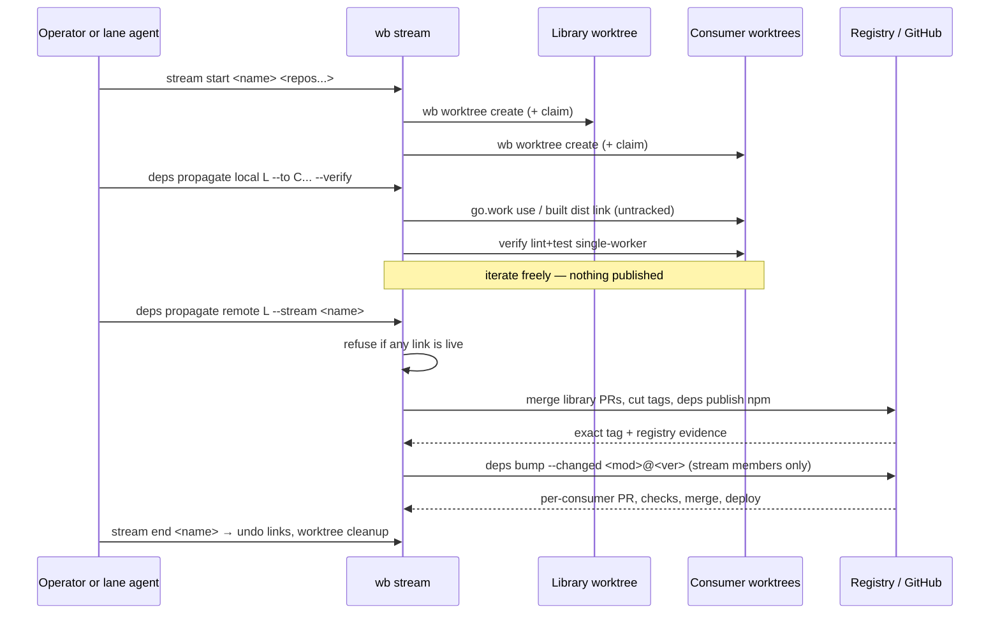

# Feature: Dependency Streams

> [SpecScore.**Studio**](https://specscore.studio): | [Explore](https://specscore.studio/app/github.com/sneat-dev/wb/spec/features/dependency-streams?op=explore) | [Edit](https://specscore.studio/app/github.com/sneat-dev/wb/spec/features/dependency-streams?op=edit) | [Ask question](https://specscore.studio/app/github.com/sneat-dev/wb/spec/features/dependency-streams?op=ask) | [Request change](https://specscore.studio/app/github.com/sneat-dev/wb/spec/features/dependency-streams?op=request-change) |
**Status:** Draft
**Source Ideas:** —
**Supersedes:** —

## Summary

A **stream** is one named cross-repository unit of work spanning a library and
the consumers that must change with it. Inside a stream, a consumer builds
against the library's *working tree* through an untracked local link, so a
change is proven across every affected repository before anything is published.
Publication and consumer bumps happen once, at the end, as a single deliberate
wave over exactly the repositories the stream linked.

## Problem

Changing a shared library and its consumers together currently costs one full
release cycle per iteration. Each attempt publishes a version, waits for
registry or tag visibility, opens consumer pull requests, waits for CI, merges,
and only then discovers whether the consumer compiles. A wrong guess costs
another published version, so the version stream fills with releases that exist
only because someone needed to compile something.

`wb deps bump` and `wb deps publish npm` already make that cycle correct and
resumable, but they cannot make it cheap: they are remote propagation, and
remote propagation is the expensive half. Nothing in WB lets a consumer build
against an unpublished library, and nothing records that several worktrees are
one piece of work — so an operator holds the set in their head, and a
half-finished cross-repository change is indistinguishable from an abandoned
one.

The founder's directive states the intended shape directly: *"do less deps
propagations and work more with locally changed deps and propagate at the end"*
and *"stream is a good idea"*.

## Behavior

### Stream lifecycle

#### REQ: stream-is-a-named-set-of-worktrees

WB MUST expose `wb stream start <name> <owner/repository>...`, which creates one
worktree per repository by delegating to the existing
[`wb worktree create <task> [owner/repository...]`](../worktree-lifecycle/README.md)
— including its branch policy, `--original-prompt-file` archival, and the
fleet-wide [remote claim](../remote-claims/README.md) — and records the
resulting set as one stream. The stream name MUST be the worktree task name, so
a stream introduces no second identity for the same work. WB MUST NOT invent a
new worktree creation path.

A stream MUST distinguish exactly one **library** role from one or more
**consumer** roles, because propagation direction is not symmetric. The library
is the repository whose published artifacts the others resolve.

#### REQ: stream-state-is-untracked-and-local

Stream membership, role assignment, and every live link MUST be recorded in
WB-owned state outside the source repositories, alongside the existing
[Work Log](../work-log/README.md). No file inside any member repository may be
created or modified to record stream membership. A stream MUST be readable after
an interrupted session, and `wb stream status` MUST reconstruct it from that
state rather than from repository contents.

#### REQ: stream-status-reports-the-three-gaps

`wb stream status` MUST report, for the whole stream: which consumers currently
hold a live local link and to which library worktree; which library changes are
merged but not yet tagged or published; and which consumers still declare a
version older than the library's newest published version. These are the three
states in which a stream is incomplete, and each MUST be reported separately —
a merged-but-untagged library is not the same problem as a consumer left behind.

#### REQ: stream-end-restores-published-state

`wb stream end <name>` MUST remove every live link the stream created,
restoring each consumer to its published dependency versions, before delegating
worktree removal to the existing
[`wb worktree cleanup`](../worktree-lifecycle/README.md). It MUST refuse to
report success while any link remains. Ending a stream MUST NOT publish, bump,
or merge anything.

### Local propagation

#### REQ: local-link-discovers-what-the-library-publishes

`wb deps propagate local <library-worktree> --to <consumer-worktree>...` MUST
discover the library's published identities from the library worktree itself:
the Go module path from `backend/go.mod` (or the module root, where the
repository has no `backend/`), and npm package names from `libs/**/package.json`.
Discovery MUST be evidence-based and MUST NOT accept an operator-supplied
package name as a substitute; a consumer that does not depend on any discovered
identity MUST be reported and skipped rather than linked.

#### REQ: go-consumers-link-through-an-untracked-go-work

For a Go consumer, WB MUST write a `go.work` at the consumer worktree root
containing a `use` entry for the library worktree, and MUST ensure that path is
Git-excluded so it can never be committed. `go.work` MUST NOT be added to the
repository's tracked `.gitignore` if that file is tracked; WB MUST use a
worktree-local exclude instead.

CI MUST be unaffected, and the reason MUST be structural rather than
conventional: the file does not exist in the repository, so a CI checkout has no
`go.work` to honour. Where a toolchain might otherwise discover one, WB MUST
document `GOWORK=off` as the explicit guarantee. WB MUST NOT add a `replace`
directive to `go.mod`.

#### REQ: npm-consumers-link-through-a-built-dist

For an npm consumer, WB MUST build the library once using the repository's own
build target, then link the built output into the consumer's `node_modules`
using the package manager's own link mechanism, so no tracked file changes.

WB MUST NOT write a `pnpm` override, alias, or `workspace:` protocol entry into
`pnpm-workspace.yaml` or any `package.json`. This is a hard prohibition, not a
default: the founder rule forbids build-tooling workarounds in tracked config,
and an override is exactly the artefact that survives the stream, reaches CI,
and makes a consumer build against something the registry never published.

#### REQ: verify-runs-single-worker-against-the-linked-copy

`--verify` MUST run each consumer's lint and tests against the linked library
through the existing [`wb verify`](../fleet-quality/README.md) /
[`wb check`](../fleet-quality/README.md) profiles, constrained to a single
worker: Node toolchains with `--maxWorkers=1 --parallel=1` and `NX_DAEMON=false`
in the environment, Go with `go test -p 1` and without `-race`. Verification
MUST report per consumer and MUST NOT stop at the first failure, because the
point of a stream is to learn about every consumer in one pass.

#### REQ: links-are-recorded-and-undoable

Every link MUST be recorded in stream state at the moment it is created, with
enough detail to reverse it exactly: the consumer, the library, the mechanism,
and the dependency version that was in effect before linking. `--undo` MUST
restore those published versions and remove the link. `--undo` MUST succeed even
if the library worktree has since been removed, because the recorded state — not
the library — is the source of truth for reversal.

#### REQ: merge-refuses-a-linked-worktree

[`wb worktree merge`](../mechanical-worktree-merge/README.md) MUST refuse to
push or land a worktree that has a live link recorded in stream state, or a
`go.work` containing a `use` entry, and MUST name the offending link and the
command that clears it. The refusal MUST be based on both signals independently:
state alone would miss a hand-written `go.work`, and `go.work` alone would miss
an npm link. There MUST be no flag that both bypasses this guard and pushes.

### Remote propagation

#### REQ: remote-propagation-is-the-end-of-stream-wave

`wb deps propagate remote <library-worktree> [--stream <name>]` MUST perform the
end-of-stream wave by composing existing commands rather than reimplementing
them: it MUST ensure the library's pull requests are merged and its tags cut,
publish and verify npm packages through
[`wb deps publish npm`](../npm-release-propagation/README.md) with its exact
registry evidence, and propagate to consumers through
[`wb deps bump <ecosystem>`](../dependency-bump-waves/README.md) using
`--changed <module>@<version>` seeded from the verified release events.

#### REQ: remote-propagation-bumps-only-stream-members

Consumer selection MUST come from the stream's recorded links, not from a fleet
scan. WB MUST NOT bump a repository that was not linked in the stream, even when
`wb deps graph` shows it depends on the library. A repository that depends on
the library but was never linked was never verified against these changes, and
belongs to the safety net described below rather than to this wave.

#### REQ: remote-propagation-reports-per-consumer

For each consumer WB MUST open one grouped pull request, wait for checks, merge
when green — reusing `wb deps bump`'s existing `--pr`, `--merge`, and CI-wait
behavior — and verify the resulting deploy where the repository has one. The
report MUST state, per consumer, the versions moved, the pull request, the check
outcome, and the deploy evidence. A consumer whose checks fail MUST leave the
stream open and MUST NOT block the reporting of the others.

#### REQ: remote-propagation-refuses-live-links

`wb deps propagate remote` MUST refuse to start while any link in the stream is
live, and MUST name them. Publishing a library whose consumers are still
resolving it from a working tree would verify nothing.

## Architecture

WB owns the stream identity, the link record, and the two guards. It owns no new
publication, bump, worktree, or claim mechanics: those remain with
`wb deps publish`, `wb deps bump`, `wb worktree create/merge/cleanup`, and
`wb remote claim`. The link record is the only new durable state, and it lives
beside the Work Log, never in a member repository.

## Acceptance Criteria

### AC: stream-groups-worktrees-under-one-name

**Requirements:** dependency-streams#req:stream-is-a-named-set-of-worktrees, dependency-streams#req:stream-state-is-untracked-and-local

**Given** an operator names a stream and three repositories
**When** they run `wb stream start`
**Then** WB creates one worktree per repository through the existing worktree
creation path with its claim and Work Log archival, records the three as one
stream in WB-owned state outside every repository, and `git status` in each
worktree reports no new or modified file.

### AC: status-separates-linked-untagged-and-behind

**Requirements:** dependency-streams#req:stream-status-reports-the-three-gaps

**Given** a stream in which one consumer holds a live link, the library has a
merged pull request with no tag, and a second consumer declares an older
published version
**When** the operator runs `wb stream status`
**Then** all three conditions are reported separately and named per repository,
and the report is produced from stream state after a session restart.

### AC: go-consumer-builds-against-the-library-worktree

**Requirements:** dependency-streams#req:local-link-discovers-what-the-library-publishes, dependency-streams#req:go-consumers-link-through-an-untracked-go-work

**Given** a Go consumer that requires the library's module path and a library
worktree containing an uncommitted change to that module
**When** the operator runs `wb deps propagate local <library> --to <consumer>`
**Then** the consumer compiles against the working-tree library, a `go.work`
with a `use` entry exists at the consumer worktree root, `go.mod` is unchanged,
`git status` reports a clean tree, and the same build with `GOWORK=off` resolves
the published version instead.

### AC: npm-consumer-links-without-tracked-config

**Requirements:** dependency-streams#req:npm-consumers-link-through-a-built-dist

**Given** an npm consumer depending on a package the library publishes
**When** the operator links it locally
**Then** the library is built once with the repository's own build target and
linked from its dist into the consumer's `node_modules`; `pnpm-workspace.yaml`
and every `package.json` are byte-identical to their committed contents; and no
override, alias, or `workspace:` entry is introduced anywhere in tracked config.

### AC: verify-reports-every-consumer-single-worker

**Requirements:** dependency-streams#req:verify-runs-single-worker-against-the-linked-copy

**Given** two linked consumers, one of which fails its tests against the
library's change
**When** the operator adds `--verify`
**Then** both consumers are verified against the linked copy, Node runs carry
`--maxWorkers=1 --parallel=1` with `NX_DAEMON=false` and Go runs use
`go test -p 1` without `-race`, the failure is attributed to its consumer, and
the passing consumer is still reported.

### AC: undo-restores-published-versions

**Requirements:** dependency-streams#req:links-are-recorded-and-undoable

**Given** consumers linked to a library worktree that has since been deleted
**When** the operator runs `wb deps propagate local --undo`
**Then** every consumer resolves its published version again, no `go.work` or
package link remains, each worktree is clean, and the operation succeeds without
reading the removed library worktree.

### AC: merge-refuses-while-a-link-is-live

**Requirements:** dependency-streams#req:merge-refuses-a-linked-worktree

**Given** a consumer worktree with a live link, and separately a worktree with a
hand-written `go.work` containing a `use` entry and no stream record
**When** `wb worktree merge` is run on either
**Then** it refuses before any push, names the link or the `use` entry and the
command that clears it, and no flag combination both bypasses the guard and
pushes.

### AC: remote-wave-publishes-then-bumps-only-members

**Requirements:** dependency-streams#req:remote-propagation-is-the-end-of-stream-wave, dependency-streams#req:remote-propagation-bumps-only-stream-members, dependency-streams#req:remote-propagation-reports-per-consumer

**Given** a stream whose links have been undone, whose library changes are
merged, and a fourth repository that depends on the library but was never in the
stream
**When** the operator runs `wb deps propagate remote --stream <name>`
**Then** the library is tagged and published with exact registry evidence before
any consumer changes, exactly the stream's consumers receive one grouped pull
request each, the fourth repository receives none, and the report states per
consumer the versions moved, the pull request, the check outcome, and the deploy
evidence.

### AC: remote-wave-refuses-live-links

**Requirements:** dependency-streams#req:remote-propagation-refuses-live-links, dependency-streams#req:stream-end-restores-published-state

**Given** a stream with one live link remaining
**When** the operator runs `wb deps propagate remote`
**Then** it refuses before publishing anything and names the live link; and when
the operator instead runs `wb stream end`, every link is undone and the command
refuses to report success while any link remains.

## Rehearse Integration

Every acceptance criterion has a deterministic CLI, Git, filesystem, or process
surface. Pending scenario stubs live under `_tests/` and are intended to use
temporary Git remotes plus fake registry, GitHub, and build adapters, so no
scenario publishes a package or opens a real pull request. The link guards are
observable without a network: `git status`, the presence or absence of
`go.work`, and byte-comparison of tracked manifests against `HEAD`.

## Not Doing

- Migrating any repository into a monorepo, or introducing a permanent
  multi-repo workspace.
- Committing `replace` directives, `go.work` files, `pnpm` overrides, aliases,
  or `workspace:` protocol entries to any repository.
- Changing Renovate presets, schedules, or automerge policy from wb.
- Replacing `wb deps bump`, `wb deps publish`, `wb worktree create/merge`, or
  `wb remote claim` with stream-specific implementations.
- Publishing from a developer machine: publication remains the repository's own
  workflow, as [NPM release propagation](../npm-release-propagation/README.md)
  already requires.
- Cross-machine streams. A stream is local to one workstation; its worktrees are
  claimed fleet-wide, but its links are not shared.

## Open Questions

**Should own-library consumer bumps keep flowing through Renovate once
`wb deps propagate remote` exists?** Renovate's own-library automerge is
currently the mechanism that keeps every consumer on the latest release, and it
is the only thing that covers repositories nobody put in a stream. But once a
stream publishes and bumps its members deliberately, Renovate becomes a second
writer for the same edges, and the two can open competing pull requests for the
same version.

Recommendation: keep Renovate as the **safety net**, not the primary path, and
give own-library groups a daily `automergeSchedule` window. Streams then own the
fast path for work that is in flight, Renovate closes the gap for everything
else within a day, and the two cannot race in the minutes after a publish. The
alternative — making `propagate remote` the only path — would leave any consumer
outside a stream silently behind, which is the failure this fleet has already
had once.

Related policy item, deliberately **not** part of this feature: auto-tagging
currently cuts a release tag for commits that touch only tests or documentation,
so the version stream carries releases with no consumer-visible change. That
inflates every wave this feature triggers, but it is a CI policy question for
the tagging workflow rather than a stream behavior.

---
*This document follows the https://specscore.md/feature-specification*
