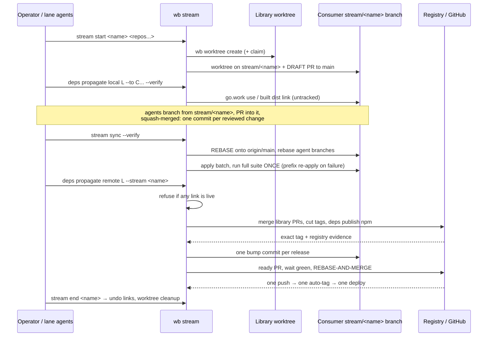

# Feature: Dependency Streams

> [SpecScore.**Studio**](https://specscore.studio): | [Explore](https://specscore.studio/app/github.com/sneat-dev/wb/spec/features/dependency-streams?op=explore) | [Edit](https://specscore.studio/app/github.com/sneat-dev/wb/spec/features/dependency-streams?op=edit) | [Ask question](https://specscore.studio/app/github.com/sneat-dev/wb/spec/features/dependency-streams?op=ask) | [Request change](https://specscore.studio/app/github.com/sneat-dev/wb/spec/features/dependency-streams?op=request-change) |
**Status:** Draft
**Source Ideas:** —
**Supersedes:** —

## Summary

A **stream** is one named cross-repository unit of work spanning a library and
the consumers that must change with it: a consumer builds against the library's
*working tree* through an untracked local link, so a change is proven across
every affected repository before anything is published; each downstream
repository accumulates the work on one `stream/<name>` branch kept current by
rebase and landed by rebase-and-merge, so history stays linear and granular; and
publication with consumer bumps happens once, at the end, over exactly the
repositories the stream linked.

There are no merge commits and no single opaque squash at the end. Verification
is batched: a stream applies a whole batch and runs the suite once, re-applying
cumulative prefixes only when that run fails. Every verb appends a structured event to the stream's
own log, which is the single source for an animated timeline and the metrics
that make the stream's cost and waits measurable rather than remembered.

## Problem

Changing a shared library and its consumers together currently costs one full
release cycle per iteration. Each attempt publishes a version, waits for
registry or tag visibility, opens consumer pull requests, waits for CI, merges,
and only then discovers whether the consumer compiles. A wrong guess costs
another published version, so the version stream fills with releases that exist
only because someone needed to compile something.

`wb deps bump` and `wb deps publish npm` already make that cycle correct and
resumable, but they cannot make it cheap: they are remote propagation, and
remote propagation is the expensive half. Nothing in WB lets a consumer build
against an unpublished library, and nothing records that several worktrees are
one piece of work — so an operator holds the set in their head, and a
half-finished cross-repository change is indistinguishable from an abandoned one.

Two further costs compound it. **History**: several agents working the same
repository during one effort, plus a bump per upstream release, produce either a
thicket of merge commits or one squashed commit that hides every change. Neither
is reviewable. **Time and CPU**: ten dependency bumps land as ten pushes, each
re-running the full lint/vet/test suite through commit and push hooks and again
in CI — on a 4-core workstation that is the difference between a stream that
lands in an hour and one that occupies a day.

A third cost is **abandoned worktrees**, and its causes are specific rather than
cultural. The founder asked why agents do not clean up after themselves; the
measured answers from one night's sweep (60 checkouts down to 35) are:

- The orchestrator landed pull requests with raw `gh pr merge`, because wb's
  merge stage breaks on the installed `gh` 2.45 — so the **opt-in `--cleanup`
  never ran**. An opt-in cleanup attached to a verb people cannot use is not a
  cleanup policy.
- Reviewers created **detached checkouts**, which wb warns about and then drops
  from its inventory, so nothing can retire them. Every review makes one.
- Lanes were told to keep worktrees for the next round, and **nothing marks the
  last round**, so "keep for now" never expires.
- **Squash merges hide merged-ness**: 7 of 11 refusals were demonstrably merged
  branches carrying one residual local commit.
- No worktree carried an **owner or a TTL**, so nothing could tell an abandoned
  tree from a paused one.

None of these is an agent forgetting. Each is a verb that made the tidy path the
harder one.

The founder's directive states the intended shape directly: *"do less deps
propagations and work more with locally changed deps and propagate at the end"*
and *"stream is a good idea"* — and, on history: *"What I don't want to have is
a lot of merge commits. Want to have clean but granular history."*

## Principles

These are stream-wide rules, not per-command details. Every REQ below is an
application of one of them.

#### REQ: one-verb-per-operation

Any operation that needs more than one `gh` or `git` call to complete **and
verify** MUST be exactly one wb verb. An operator or agent MUST NOT be expected
to chain calls and check the result by eye: the sequence, its waits, and its
verification are the verb's responsibility. A verb MUST report the evidence it
relied on, so a caller never has to re-derive it.

The founder's framing: *"Make deterministic operations when multiple tool calls
required to be performed by wb."*

#### REQ: verbs-state-and-deduplicate-their-work

Every verb MUST state which checks it will run before running them, and MUST run
a given check at most once for the same inputs within one invocation. Re-running
an identical check on unchanged inputs is a defect, not a safety margin.

#### REQ: stream-speed-and-cpu-are-first-class

Stream latency and CPU load MUST be treated as correctness constraints, not
preferences. Verification MUST be batched by default (see Batch verification),
and MUST respect the workstation's concurrency cap — this fleet's is **3
concurrent lanes on a 4-core VM, at most one Angular build and at most two Go
builds**. A design that is correct but re-verifies the same tree ten times MUST
be rejected.

The founder's framing: *"optimize number of tests and vet/lint etc we run … we
don't want to run test 10 times if we merge 10 deps bumps … This is critical and
should be one of the main wb principles — care about speed of stream and cpu
load."*

#### REQ: every-refusal-names-the-sanctioned-command

Every wb guard that refuses MUST name, in its own failure output, the exact
command that satisfies it; and there MUST be no flag that both bypasses a guard
and pushes.

#### REQ: verbs-share-an-exit-code-and-envelope-contract

This design is refusal-driven end to end, so a caller MUST be able to tell
**refused** (a guard fired; fix and retry) from **failed** (the work is broken)
without parsing prose. Every verb MUST use:

| code | meaning |
|---|---|
| `0` | success |
| `1` | findings — the work is broken, or a check failed |
| `2` | refusal or usage error — a guard fired, or the invocation was ambiguous |

An ambiguous selector MUST exit `2` with the candidates listed; a
not-mergeable pull request MUST exit `1` with the exact failing check.

Every verb MUST also support `--format json` emitting a stable envelope:

```json
{
  "v": 1,
  "verb": "pr land",
  "outcome": "success | findings | refused",
  "refusal_code": "live-link | unapproved-patch-set | lease-failed | …",
  "sanctioned_command": "wb deps propagate local --undo …",
  "evidence": { "…": "the exact facts the verb relied on" },
  "saved_tool_calls": 4,
  "saved_tokens_est": 3200
}
```

Without this, `one-verb-per-operation` hands an agent a verb it cannot branch on,
and the agent goes back to hand-chaining `gh` — the exact regression
`land-verbs-work-with-the-installed-gh` records.

#### REQ: waits-are-verbs-not-instructions

Any wait longer than a blocking tool's own ceiling MUST be owned by a wb verb
that states its ceiling; wb MUST NOT expect a caller to "poll until it settles".

#### REQ: verbs-assert-effects-not-exit-codes

Every verb MUST verify the observable effect — a ref on the remote, a resolvable
tag, an HTTP 200, a registry dist-tag — never an exit status, and MUST NOT pipe a
command whose success it will then trust.

#### REQ: stream-verbs-re-read-state-before-mutating

Every stream verb MUST re-fetch and re-read origin and stream state immediately
before acting. A value read at session start is a snapshot, not a live view.

## Delivery — P0, P1, P2

This Feature carries three separable products at equal normative weight: the
stream + local-link core (directives 1–4), the review contract and ledger, and
the analytics/sharing stack. Only the first is needed to satisfy directives 1–4,
and a monolith with no order would be implemented breadth-first and be unusable
until all of it existed.

**Normative rule.** A REQ or AC carrying a `**Phase:** P1` or `**Phase:** P2`
line is **not normative for the first release**. Everything untagged is P0 and
binding. Nothing in P0 depends on a P1 or P2 requirement.

### P0 — in this order

| # | Verb / change | Why here |
|---|---|---|
| 1 | `wb worktree gc` + inventory fixes (`detached-review`, silent stage/lock purge, `landed + residue`, merged-ness by patch identity, owner/age/TTL, no force flag) | Directive 8; pure-local; 10 detached review checkouts are invisible to wb today, on a disk at 89% |
| 2 | `wb pr land` — cleanup by default + `--keep`, vendored `gh` API calls (2.45), explicit `--subject`, and `mechanical-bumps-are-not-reviewed` | The measured root cause: the opt-in `--cleanup` never ran because the merge stage broke on the installed `gh` |
| 3 | `wb disk` + `wb cache prune` | Directive 8; `stream start`'s disk floor depends on them |
| 4 | Exit-code + JSON-envelope contract, applied to 1–3 and everything after | Retrofitting it later means rewriting every skill section |
| 5 | `wb stream start / join / status / end` + stream state + event log v1 (versioned, redacted, concurrent-append) | The identity everything else hangs off; `join` is the sanctioned answer to the one-stream-per-repo refusal; no `sync` yet |
| 6 | `wb deps propagate local` + `wb worktree merge` link refusal | **Directive 1** — the feature's actual value |
| 7 | Hook profiles + `wb hooks metrics` delta | Directive 4's local half; the evidence base for every later cost claim |
| 8 | `wb stream sync` — rebase with `--force-with-lease`, per-branch conflict reporting, approval carry-forward, live-link refusal, CI concurrency guard | Directive 2; the hardest verb, testable only after 5–7 |
| 9 | Batch verification + prefix re-apply, with the CI-mechanism presence check | Directive 4's real payload; its AC is the acceptance gate for the whole feature |
| 10 | `wb deps propagate remote --stream` | Directive 1's other half; composes `deps publish npm` + `deps bump` |
| 11 | `wb report export` + `wb stats savings` (mode 0 only) + minimum-version assertion and post-release `wb self-update` | Directives 6–7 at their cheapest, most private delivery mode |

Every row ships with its skill section — `a-verb-without-a-skill-section-fails-the-build`
is the gate on each.

### P1 — after P0 is usable

The review contract, ledger, template families and probe loop (**except**
`mechanical-bumps-are-not-reviewed`, which ships with row 2 because it is what
makes `pr land` usable on bump pull requests); `wb report fleet` and the
metric-regression lesson proposal; `wb release verify`; `wb deploy watch`;
`wb renovate run --wait`.

### P2 — needs a lifetime bound or prior data

`wb serve` and `wb report publish` and the live relay — the Orca benchmark's
Reject list says *"do not grow a `wb serve`"*, and mode 1's SSE stream is a
long-lived process by construction, so it needs an explicit lifetime bound and
auto-shutdown before it can be argued; `wb stats calibrate`, which cannot
calibrate anything until two streams of data exist.

## Behavior

### Stream lifecycle

#### REQ: stream-is-a-named-set-of-worktrees

WB MUST expose `wb stream start <name> <owner/repository>...`, which creates one
worktree per repository by delegating to the existing
[`wb worktree create <task> [owner/repository...]`](../worktree-lifecycle/README.md)
— including its branch policy, `--original-prompt-file` archival, and the
fleet-wide [remote claim](../remote-claims/README.md) — and records the
resulting set as one stream. The stream name MUST be the worktree task name, so
a stream introduces no second identity for the same work. WB MUST NOT invent a
new worktree creation path.

A stream MUST distinguish exactly one **library** role from one or more
**consumer** roles, because propagation direction is not symmetric. The library
is the repository whose published artifacts the others resolve.

#### REQ: stream-state-is-untracked-and-local

Stream membership, role assignment, and every live link MUST be recorded in
WB-owned state outside the source repositories, alongside the existing
[Work Log](../work-log/README.md). No file inside any member repository may be
created or modified to record stream membership. A stream MUST be readable after
an interrupted session, and `wb stream status` MUST reconstruct it from that
state rather than from repository contents.

#### REQ: stream-status-reports-the-three-gaps

`wb stream status` MUST report, for the whole stream: which consumers currently
hold a live local link and to which library worktree; which library changes are
merged but not yet tagged or published; and which consumers still declare a
version older than the library's newest published version. These are the three
states in which a stream is incomplete, and each MUST be reported separately —
a merged-but-untagged library is not the same problem as a consumer left behind.

#### REQ: stream-end-restores-published-state

`wb stream end <name>` MUST remove every live link the stream created,
restoring each consumer to its published dependency versions, before delegating
worktree removal to the existing
[`wb worktree cleanup`](../worktree-lifecycle/README.md). It MUST refuse to
report success while any link remains. Ending a stream MUST NOT publish, bump,
or merge anything.

#### REQ: stream-start-proves-the-fleet-is-ready

`wb stream start` MUST, per member, run `wb hooks check`, the npm
provider-identity scan, and a red-`main` check, and MUST refuse or explicitly
report each member that fails.

#### REQ: stream-membership-is-proposed-from-the-transitive-graph

Membership MUST be proposed from `wb deps graph`'s full transitive walk, and any
transitive consumer left out MUST be named in the report — because
`remote-propagation-bumps-only-stream-members` will otherwise leave it silently
behind.

#### REQ: worktrees-derive-their-ambient-resources

Each stream worktree MUST receive a derived port base, private scratchpad path,
and temp/emulator namespace, exported into every verification run; two worktrees
of one repository MUST be able to verify concurrently.

#### REQ: stream-end-proves-absorption-and-removes-its-own-scaffolding

`wb stream end` MUST refuse to remove a member whose branch has commits not
absorbed by the landing — a named, content-level check, never a path listing —
MUST close or report its draft pull requests, and MUST delete its own
task-directory scaffolding.

Before the stream branch is deleted, `wb stream end` MUST additionally enumerate
every **still-open agent pull request** targeting it and close or retarget each,
reporting what it did. GitHub auto-retargets an open pull request to the base's
own base when its base branch is deleted, so deleting `stream/<name>` silently
converts every leftover agent pull request into one targeting `main` — precisely
the misrouted condition this Feature guards against, arriving with no operator
mistake to blame.

#### REQ: every-stream-verb-has-a-terminal-recovery

Every reachable `(phase, status)` of a stream verb MUST have a recovery
transition, tested against reachable states rather than imagined ones. An
environment failure MUST NOT strand a member whose work is provably complete.

### Linear history

#### REQ: stream-branch-with-draft-pr

For each downstream repository, `wb stream start` MUST create exactly one
worktree on branch `stream/<name>` and open a **draft** pull request from it to
`main`, so CI runs on every push to the stream branch and the stream's true
state is always visible. The draft PR MUST NOT be marked ready by `start`; only
landing does that.

#### REQ: agent-branches-squash-into-the-stream

Agents working inside a stream MUST branch from `stream/<name>` into their own
worktrees, with claims exactly as today, and open pull requests **against the
stream branch**, never against `main`. After review each agent PR MUST be landed
into the stream branch with a **squash** merge, producing exactly one commit per
reviewed change.

That one-commit-per-reviewed-change rule is the stream's granularity
**assumption**, recorded as such: it is what makes the final history granular
without carrying every intermediate "fix typo" commit. The alternative — keeping
each agent's raw commits — is an Open Question below.

#### REQ: upstream-bumps-are-one-commit-each

An upstream library release MUST reach the stream branch as exactly **one
commit per bump**. `wb stream sync` MUST write that version bump once the
library is tagged and published. Before the library is tagged, consumers MUST
use `wb deps propagate local` links instead, so an unpublished library never
produces a version-bump commit.

WB MUST NOT open Renovate-style pull requests against `main` for a dependency
that is inside an open stream. Renovate itself keeps running unchanged — see
`renovate-bumps-daily-and-independently-of-streams` below.

#### REQ: sync-rebases-and-never-merges

`wb stream sync` MUST rebase `stream/<name>` onto the freshly fetched
`origin/main` — never merge it — and MUST then rebase every open agent branch of
the stream onto the new stream head. WB knows those branches from the stream's
claims and recorded membership, so the operator MUST NOT have to name them.

Conflicts MUST be reported **per agent branch**, naming the branch, the agent
that claimed it, and the conflicting paths; a conflict in one agent's branch
MUST NOT abort the rebase of the others. Sync MUST refuse by default while an
agent pull request is mid-review, and MUST offer an explicit flag to proceed
with a warning, because rebasing a branch under review invalidates the review.

#### REQ: sync-is-idempotent-against-landed-bumps

`wb stream sync` and Renovate are two writers for the same edge: a consumer
inside an open stream can receive a library bump from either. Sync MUST therefore
be **idempotent**, and its ordering is the mechanism:

1. **Rebase first** onto the freshly fetched `origin/main`, so anything Renovate
   already landed is present in the tree.
2. **Then**, for each library in scope, compare the version the consumer now
   requires against the target. Write a bump commit **only where the required
   version is still below the target**.

A bump Renovate has already landed MUST NOT be re-written. Running `sync` twice
with no intervening change MUST produce **no new commits** the second time.

#### REQ: landing-is-rebase-and-merge

`wb stream propagate` MUST land a downstream repository by: performing a final
`wb stream sync`, marking the stream pull request ready, waiting for green
checks, and merging it with GitHub's **rebase and merge**, which yields a
**linear, granular** history — the stream's changes arrive on `main` as
individual commits with no merge commit. The result MUST be **one push, one
auto-tag, and one deploy per repository**, rather than one per constituent
change.

**GitHub's rebase-and-merge always rewrites the commits.** It replays them onto
the base with new committer metadata and **new SHAs**, even where a true
fast-forward was available. This Feature therefore MUST NOT claim, anywhere,
that `main` fast-forwards or that it receives the stream's commit *objects*: it
receives content-identical **copies**. Every downstream rule — merged-ness,
cleanup proof, branch deletion — MUST be expressed in terms of **patch identity**
(`git patch-id --stable`) plus the pull request's merge record, never ancestry of
the stream branch. wb MUST record the rewritten SHAs, paired with the source
SHAs they came from, in the stream ledger, because after landing they are the
only way back to the original commits.

WB MUST verify the repository permits rebase merges before starting, and MUST
name any repository where it is disabled rather than silently falling back.
Audited 2026-09-03: `allow_rebase_merge` is `true` on all 28 sneat-co product
repositories and on `sneat-dev/wb`, so no repository currently needs enabling.

There is **no direct-push alternative**. Rebase-and-merge is the landing, on every
repository: a `git push stream/<name>:main` would preserve the original commit
objects, but it also bypasses the pull request's green-checks gate and the
protection fence that `propagate-remote-audits-protection-per-consumer` and
`all-fences-run-before-the-first-side-effect` exist to enforce. Rewritten SHAs are
accepted, and patch identity is how this Feature copes with them.

#### REQ: never-merge-commit-a-stream-branch

WB MUST refuse to land a `stream/<name>` branch with a merge commit, on any route
it controls, and MUST say which route it will use instead.

A refusal inside wb cannot enforce a property of the remote, so this MUST be
**detection plus a named remediation** rather than an asserted invariant:
`wb stream start` MUST report every member where merge commits are permitted
(`allow_merge_commit: true`, or no ruleset forbidding them) and name the
remediation; and after landing, wb MUST post-check `git log --merges` over the
landed range and report any merge commit it finds. `allow_merge_commit` is `true`
on 26 of the 28 audited product repositories, so the unwanted route is available
in the UI and to any caller that does not go through wb.

While a stream is open, [`wb worktree merge --route auto`](../mechanical-worktree-merge/README.md)
MUST route an agent worktree of that stream to the **stream branch**, not to
`main`. If an agent pull request is nonetheless found open against `main` while
its repository has an open stream, WB MUST report it as misrouted, name the
stream branch it belongs to, and MUST NOT merge it as part of stream work.

#### REQ: dependency-bumps-are-commits-on-the-stream-branch

An own-library version bump MUST NOT get its own worktree, its own pull request,
or an agent. `wb stream sync` MUST apply bumps **inside the stream's existing
worktree** — it needs a checkout, because `go get` / `go mod tidy` and
`pnpm install --lockfile-only` must run to update `go.sum` and `pnpm-lock.yaml`
— and MUST produce **one commit per library**, subject-formatted to the
repository's own convention (`fix(deps): <module> vX → vY`, or `chore(deps): …`
where that is the repository's style), pushed to `stream/<name>`.

The batch is verified once under the batch-verification requirements, and on
failure resolved by cumulative prefix re-apply over the bump commits.

The founder: *"I wonder if deps propagation can be made directly on stream branch
so we do not create worktree for small deps changes."*

**Exception, and it is the important half.** A bump that needs code adaptation is
not a mechanical bump. When applying a bump breaks compilation, wb MUST stop,
report the failing library and the break, and MUST NOT attempt to adapt the code.
That becomes an **agent task on the stream** with its own worktree and a pull
request into the stream branch, exactly like any other reviewed change.

Repositories outside any stream are covered entirely by Renovate's independent
daily path, unchanged.

#### REQ: renovate-bumps-daily-and-independently-of-streams

Renovate remains the fleet's **independent daily mechanism** for own-library
versions, and this Feature does not displace it. Founder decision, 2026-09-03:
*"Yes, renovate should bump deps daily independently."*

- Own-library groups keep **creating pull requests immediately** on a release, as
  today, and **auto-merge them in a daily window** — `automergeSchedule` in the
  `cicd` / `sneat-renovate-*` presets, early morning `Europe/Dublin`. Immediate
  creation keeps the drift visible; the window is what stops Renovate and a
  stream racing in the minutes after a publish.

  **Prerequisite, owned outside this Feature and already met:** the window is a
  preset change, and wb MUST NOT make it (see Not Doing). It landed in
  `sneat-co/cicd#31` and `sneat-co/sneat-renovate-go#19` on 2026-09-03. Recording
  the owner and repository here is deliberate: without it the acceptance criterion
  below would fail at test time for a reason no implementer could act on.
- `wb deps propagate remote` is for **planned waves** — the members a stream
  verified together — not for routine version currency.
- A consumer **inside an active stream** still receives Renovate's bump **on
  `main`**, never on the stream branch. `wb stream sync` then carries it into the
  stream by rebasing onto the updated `origin/main`, which is why sync rebases
  rather than merges.
- A consumer in **no** stream is covered entirely by Renovate, with no human
  action and no wb involvement.

This resolves the earlier open question. The alternative — making
`propagate remote` the only path — would leave every consumer outside a stream
silently behind, which is a failure this fleet has already had. wb MUST NOT
change these presets (see Not Doing); it depends on them and reports when a
member's configuration does not match.

#### REQ: stream-backlog-is-counted-by-patch-identity

`wb stream status` and `wb worktree list` MUST collapse patch-identical branches
(`git cherry` / patch-id) and MUST name any cluster of N branches carrying one
body of work.

#### REQ: claims-carry-a-session-identity

A claim on a stream or agent branch MUST record the live registered agent
session, and a push from a different live session on the same machine MUST
refuse. Machine scope remains the fleet-wide unit; session scope is the
intra-machine unit.

#### REQ: push-verifies-the-ref-it-pushed

After any push wb MUST compare the pushed local SHA with `origin/<branch>` and
fail on divergence. A push exit code is not evidence the intended commit landed.

This REQ is scoped to **pushes only**. It MUST NOT be applied to a landed range:
after a rebase-and-merge the landed commits have different SHAs by design, and
extending this comparison there would create a second false gate.

#### REQ: stream-pushes-use-a-lease-and-a-stream-claim

Every push to `stream/<name>` MUST use `--force-with-lease` against the stream
head wb last recorded, and MUST refuse — naming the sanctioned command — when
the lease fails, because a rebase of a shared branch is a force-push and a bare
force discards whatever another agent pushed in between.

`wb stream start` MUST additionally take a **stream lease**: a claim on
`stream/<name>` in the same store as the existing worktree claims. A repository
MUST carry **at most one open stream at a time**; `wb stream start` MUST refuse a
repository that already has one, name the holding stream, and name the sanctioned
commands — wait for it, or `wb stream join <name> <owner/repository>`.

`wb stream join` MUST add a repository to an existing stream: create its stream
worktree and `stream/<name>` branch with its draft pull request exactly as
`wb stream start` does, take its claims and stream lease, and record it in the
stream's state so `status`, `sync`, `propagate` and `end` treat it as a member
from that point on. It MUST refuse a repository that is already a member of a
different open stream, for the same reason `start` does. Two concurrent streams on one repository are out of scope, and
the refusal is what keeps them so: stream A landing rewrites `main` under stream
B, whose already-approved agent branches would then all need re-rebasing and
could each conflict with A's landed work.

#### REQ: review-checkout-is-disposable

Reviewing a stream or agent branch MUST use a throwaway worktree; wb MUST refuse
a detached checkout inside a claimed worktree.

#### REQ: stream-cleanup-proof-covers-a-rebase-landing

The receipted proof chain for cleanup MUST cover rebase-and-merge landings. Because
that route rewrites SHAs, the chain MUST be: source SHA → stream head by
ancestry (this half still holds, the stream branch is not rewritten locally) →
**landed range on `origin/main` by patch-identity set equality and tree
equality**, together with the pull request's merge record. Ancestry of the stream
branch into `origin/main` MUST NOT appear anywhere in the chain: it is false by
construction after a rebase-and-merge, and a proof that requires it would refuse
every landed stream forever.

### Local propagation

#### REQ: local-link-discovers-what-the-library-publishes

`wb deps propagate local <library-worktree> --to <consumer-worktree>...` MUST
discover the library's published identities from the library worktree itself:
the Go module path from `backend/go.mod` (or the module root, where the
repository has no `backend/`), and npm package names from `libs/**/package.json`.
Discovery MUST be evidence-based and MUST NOT accept an operator-supplied
package name as a substitute; a consumer that does not depend on any discovered
identity MUST be reported and skipped rather than linked.

#### REQ: go-consumers-link-through-an-untracked-go-work

For a Go consumer, WB MUST write a `go.work` at the consumer worktree root whose
`use` entries name **every Go module in the consumer worktree** — `backend/`,
the module root where there is no `backend/`, and any nested tooling module —
**plus** the library worktree's module. A workspace containing only the library
would leave the consumer's own module outside the workspace it now sits under,
and `go build ./...` in `backend/` would not resolve at all.

WB MUST ensure `go.work` **and `go.work.sum`** are Git-excluded so neither can
be committed. WB MUST NOT add them to the repository's tracked `.gitignore` if
that file is tracked; it MUST use a worktree-local exclude instead.

CI MUST be unaffected, and the reason MUST be structural rather than
conventional: the file does not exist in the repository, so a CI checkout has no
`go.work` to honour. Where a toolchain might otherwise discover one, WB MUST
document `GOWORK=off` as the explicit guarantee. WB MUST NOT add a `replace`
directive to `go.mod`.

#### REQ: npm-consumers-link-through-a-built-dist

For an npm consumer, WB MUST build the library using the repository's own build
target, then link the built output into the consumer's `node_modules` using the
package manager's own link mechanism, so no tracked file changes.

The build MUST be **cached against the library's content hash** and rebuilt
whenever that hash moves. Building once and reusing it across an iterative stream
would have consumers verifying against a stale `dist` and reporting false green —
the failure this link exists to prevent.

WB MUST NOT write a `pnpm` override, alias, or `workspace:` protocol entry into
`pnpm-workspace.yaml` or any `package.json`. This is a hard prohibition, not a
default: the founder rule forbids build-tooling workarounds in tracked config,
and an override is exactly the artefact that survives the stream, reaches CI,
and makes a consumer build against something the registry never published.

#### REQ: no-module-graph-mutation-under-a-live-link

`go mod tidy` and `go get` resolve against the workspace, so running either while
a link is live can write a `go.sum` describing an **unpublished** library tree.
Any wb verb that mutates the module graph — notably `wb stream sync` applying a
bump — MUST therefore run it with `GOWORK=off`, set by the verb itself rather
than left to the caller, and MUST refuse if it cannot. Catching this at
`merge-refuses-a-linked-worktree` would be too late: the poisoned commit already
exists and CI has already run on it.

#### REQ: the-local-gate-states-what-it-verified-against

Locally, every `go` invocation from the worktree root down discovers the
`go.work` and therefore verifies against an **unpublished** library. That is the
point of the link, but it MUST never be mistaken for a published-dependency
result. Every verification run under a live link MUST state, in its own output,
`verified against unpublished <library> at content-hash <h> (dirty)`.

Before landing, wb MUST additionally run a **`GOWORK=off` build and vet** — the
Go analogue of `npm-link-preserves-a-frozen-lockfile-baseline` — and record its
result. Without it the Go half reintroduces
`a-local-landing-gate-must-execute-the-same-mechanisms-as-ci` through the back
door, which the npm half already guards against.

#### REQ: verify-runs-single-worker-against-the-linked-copy

`--verify` MUST run each consumer's lint and tests against the linked library
through the existing [`wb verify`](../fleet-quality/README.md) /
[`wb check`](../fleet-quality/README.md) profiles, constrained to a single
worker: Node toolchains with `--maxWorkers=1 --parallel=1`, `NX_DAEMON=false`
and `NX_SKIP_NX_CACHE=true` in the environment, Go with `go test -p 1` and
without `-race`. Verification
MUST report per consumer and MUST NOT stop at the first failure, because the
point of a stream is to learn about every consumer in one pass.

#### REQ: links-are-recorded-and-undoable

Every link MUST be recorded in stream state at the moment it is created, with
enough detail to reverse it exactly: the consumer, the library, the mechanism,
and the dependency version that was in effect before linking. `--undo` MUST
restore those published versions and remove the link. `--undo` MUST succeed even
if the library worktree has since been removed, because the recorded state — not
the library — is the source of truth for reversal.

#### REQ: merge-refuses-a-linked-worktree

`wb worktree merge` MUST refuse to push or land a worktree that has a live link
recorded in stream state, or a `go.work` containing a `use` entry, and MUST name
the offending link and the command that clears it. The refusal MUST be based on
both signals independently: state alone would miss a hand-written `go.work`, and
`go.work` alone would miss an npm link. There MUST be no flag that both bypasses
this guard and pushes.

#### REQ: verification-prints-its-active-links

Every verification run against a linked consumer MUST print the links in effect,
the published version each replaced, and the **content hash** it verified
against, so a result can be tied to an exact library tree after the fact.

#### REQ: link-discovery-uses-the-canonical-dependency-sections

Local-link discovery MUST use the same canonical dependency-field set as graph
discovery and release evidence.

#### REQ: npm-link-preserves-a-frozen-lockfile-baseline

Before linking, the consumer MUST prove a clean frozen install of its unlinked
tree, so a link never masks a lockfile or manifest mismatch.

### Batch verification

#### REQ: batch-verifies-once

`wb stream sync --verify` MUST apply the whole batch it is given — for example
ten dependency bumps plus the rebased agent changes — and then run the full
lint, vet, test and build suite **once** over the resulting tree. It MUST NOT
run the suite per applied change. The same rule applies at landing: the final
verification before merging the stream pull request is one run over the final
tree.

#### REQ: the-batch-element-is-defined

A batch **element** is exactly one of: one dependency-bump commit; one
lockstep-versioned family applied together (Angular, Nx, Ionic, Capacitor,
`@sneat/*`); or one agent pull request's squashed commit. The rebase onto a moved
`origin/main` is **not** an element — it cannot be reverted independently — and
is instead the batch's *base*.

#### REQ: batch-failure-is-found-by-prefix-re-apply

When a batch verification fails, WB MUST revert every element, then re-apply them
**cumulatively** — element 1, then 1+2, then 1+2+3, verifying after each prefix —
and MUST report the **first failing prefix**, naming its last element as the
culprit, the failing check, and the elements already proven good.

Cumulative prefix re-apply, not isolated re-application: isolated re-application
misses interaction failures, where each element passes alone and a pair does not.
The algorithm is a **linear prefix scan, not a bisection** — the names must match
what it does — and its honest cost is **one full run in the passing case, and
`1 + k` runs when the culprit is element `k`**, worst case `1 + N`. It is not
`1 + log N`.

Prefix re-apply MUST run on a **local scratch branch that is never pushed**, and
only the final green state MUST be pushed — once. Re-applying on the stream
branch itself would push `k` intermediate states, each firing a stream-PR CI run,
which is the cost this Feature exists to remove.

If **every prefix passes**, the failure came from the base or from a rebased
agent change rather than from any element. WB MUST report an **interaction
failure**, name the full element set and the base it was applied to, and stop. WB
MUST NOT leave the tree in the failed batch state in any outcome.

#### REQ: batch-verification-runs-what-ci-runs

The single batched run MUST execute CI's own mechanisms — `go vet`, `-race`
where CI uses it, `CI=1`, `-count=1`, build cache disabled — **or** name, in its
own output, each mechanism it is not running and state that CI on the stream
pull request owns it.

Before printing that claim, wb MUST **verify it**: for each mechanism named as
skipped, wb MUST parse that member repository's stream-PR workflows (reusing
`wb ci`) and confirm the mechanism is actually present. Where it is not, wb MUST
refuse the skip, or report the member as **unguarded for that mechanism** — never
print the assurance. `verify-runs-single-worker-against-the-linked-copy`
mandates Go without `-race`, so this claim will be printed routinely; an
unverified "CI owns it" is the 17-occurrence lesson reintroduced as a false
assurance, which is worse than no gate.

#### REQ: single-worker-does-not-replace-per-file-isolation

Single-worker Node verification MUST keep per-file isolation on and MUST set
`NX_SKIP_NX_CACHE=true`. Serialization is **not** a substitute for isolation: it
can make one file's leaked state deterministically poison the next, which is
worse than a flake because it is reproducible and misattributed.

#### REQ: batch-verification-is-keyed-to-a-tree-identity

A batch result MUST be recorded against the exact stream-branch SHA and, for each
live link, the library's **content hash** — not a commit SHA. The library is
uncommitted by construction (that is the whole point of the link), so it has no
SHA; the hash MUST be computed over the library working tree including untracked
and modified files, for example by `git write-tree` against a temporary index, or
an equivalent that covers the same bytes. The result MUST be invalidated when
either identity moves.

#### REQ: every-verification-run-is-bounded

The batch run and each prefix re-apply step MUST carry a timeout and MUST report a hang as
a failure, bounding descendants that hold the captured output pipe.

#### REQ: a-lockstep-family-is-one-batch-element

A lockstep-versioned family — Angular, Nx, Ionic, Capacitor, `@sneat/*` — MUST be
applied as one batch element and MUST NOT be split during prefix re-apply.

#### REQ: every-profile-declares-a-measured-budget

Every verification profile MUST carry a measured cold wall-time budget before
becoming a default, evidenced by `wb hooks metrics`.

### Hook profiles

#### REQ: commit-hook-is-fast-and-scoped

The WB-managed commit hook installed by
[`wb hooks install`](../pre-push-tiering-and-remote-checkpoints/README.md) MUST
run only formatting and static checks, scoped to the files changed in that
commit, and MUST be measured in seconds. It MUST NOT run the test suite. A
commit is not a release gate; it is a save point.

#### REQ: push-hook-defers-to-ci-on-stream-branches

The push hook MUST run **no** verification when the push target is a
`stream/<name>` branch, because that branch has a pull request whose CI verifies
every push, and a local re-run duplicates it on the very machine the stream is
trying to keep free. For every other target the current full profile MUST be
unchanged. WB MUST report which profile it selected and why.

**Moving the cost to CI obliges wb to bound CI**, or directive 4 is reversed
rather than satisfied — GitHub Actions minutes are the fleet's real money cost,
and this Feature's own metrics table promises to count redundant runs:

- Syncs MUST happen only at **batch boundaries**, never once per bump. Ten bumps
  plus one sync MUST produce **one** stream-PR CI run, not ten.
- `wb stream start` MUST verify that each member's stream-PR workflow carries a
  `concurrency` group keyed to the stream branch with `cancel-in-progress: true`,
  and MUST report every member that does not, so a superseded force-push cancels
  its predecessor instead of racing it.
- A push whose resulting tree is identical to the last verified tree MUST NOT
  trigger a fresh verification; wb MUST skip it and say so.
- Stream-PR runs MUST be counted in the **redundant runs** metric alongside local
  runs, so the CI half of the cost is visible in the same place as the local
  half.

`wb hooks metrics` MUST be able to evidence the difference — local commits, push
attempts, hook failures and durations — so the saving is measured rather than
asserted.

#### REQ: pre-push-refuses-index-worktree-divergence

Before any expensive work, the push hook MUST fail when a file touched by the
commits being pushed differs between `HEAD` and the working tree; unrelated dirt
is tolerated. This check is sub-second and is *more* necessary under streams,
where rebase and conflict resolution make index and tree drift by construction.

#### REQ: check-profile-fleet-hygiene

A `wb check` profile MUST report, on demand, canonical clones off their default
branch, dirty, or holding unpushed commits, and MUST refuse when
completed-but-unmerged worktrees exceed a small threshold.

### Remote propagation

#### REQ: remote-propagation-is-the-end-of-stream-wave

`wb deps propagate remote <library-worktree> [--stream <name>]` MUST perform the
end-of-stream wave by composing existing commands rather than reimplementing
them: it MUST ensure the library's pull requests are merged and its tags cut,
publish and verify npm packages through
[`wb deps publish npm`](../npm-release-propagation/README.md) with its exact
registry evidence, and propagate to consumers through
[`wb deps bump <ecosystem>`](../dependency-bump-waves/README.md) using
`--changed <module>@<version>` seeded from the verified release events.

#### REQ: remote-propagation-bumps-only-stream-members

Consumer selection MUST come from the stream's recorded links, not from a fleet
scan. WB MUST NOT bump a repository that was not linked in the stream, even when
`wb deps graph` shows it depends on the library. A repository that depends on
the library but was never linked was never verified against these changes, and
belongs to Renovate's independent daily path rather than to this wave.

#### REQ: remote-propagation-reports-per-consumer

For each consumer WB MUST land the stream branch as specified in
`landing-is-rebase-and-merge`, wait for checks, and verify the resulting deploy
where the repository has one. The report MUST state, per consumer, the versions
moved, the pull request, the check outcome, and the deploy evidence. A consumer
whose checks fail MUST leave the stream open and MUST NOT block the reporting of
the others.

#### REQ: remote-propagation-refuses-live-links

`wb deps propagate remote` MUST refuse to start while any link in the stream is
live, and MUST name them. Publishing a library whose consumers are still
resolving it from a working tree would verify nothing.

#### REQ: propagate-remote-preflights-the-tag

Before any tag: refuse to hand-tag a repository whose workflows do not disable
version bumping; require the intended version to be strictly greater than the
highest tag for that module prefix **and** its commit to descend from the
previous tag's commit; and verify the tag on the remote independently of the
push's exit code.

#### REQ: all-fences-run-before-the-first-side-effect

Every release fence MUST run before the first tag, package, or deployment is
created, binding repository, protected branch, reachable commit, event, workflow
path, run status and every required job. Post-tag CI is an alarm, not prevention.

#### REQ: publication-is-a-terminal-outcome

**Phase:** P1

`wb release verify` MUST require an explicit publish, or an explicit
machine-readable `not_releasable` the caller expected, and MUST confirm the tag,
publish run and registry dist-tags agree. It MUST download and run the published
artifact under a timeout, never a rebuild.

#### REQ: propagate-remote-audits-protection-per-consumer

Before marking any stream pull request ready, wb MUST verify strict
server-enforced branch protection whose required contexts match the repository's
configured workflow contexts.

#### REQ: ci-wait-tracks-the-run-that-carried-the-commit

`wb ci wait` MUST confirm the run carrying the pushed SHA reached completion,
MUST query workflow runs by SHA when no check appears, and MUST re-dispatch
rather than wait on faith.

#### REQ: deploy-watch-asserts-the-exact-commit-in-production

**Phase:** P1

`wb deploy watch` MUST fetch the deployed artifact's own version marker and bind
it to the landed commit. A green deploy run alone is not deployment truth.

#### REQ: propagate-remote-checks-the-exported-api-diff

The accepted version bump MUST be validated against the actual exported-symbol
diff, not the conventional-commit prefix; below 1.0.0 a removed export is a
minor. A migration note naming each moved or sealed symbol MUST be emitted with
the release.

#### REQ: reports-are-owner-qualified

wb MUST never print an ownerless version token; every version, tag or moving
reference names its repository in the same sentence.

### Review contract and ledger

wb owns the review **contract**, **ledger** and **landing gate**. It does not own
the reviewer runtime: dispatching the agent stays with the orchestrator, so a
reviewer keeps its warm context across rounds and re-review communication is
unchanged.

#### REQ: review-request-produces-a-tracked-checkout-and-a-brief

**Phase:** P1

`wb review request <owner/repo#N> [--round n] [--probes <template>]` MUST create
the tracked review checkout (`wb worktree review`), **pin the head SHA**, write a
brief file, and name the output review file. The orchestrator's dispatch then
becomes "send the agent this brief path" rather than a hand-assembled prompt.

#### REQ: review-briefs-come-from-a-template-family

**Phase:** P1

The brief MUST be generated, not authored. `wb review request` MUST select a
**template family** from the touched paths and repository config — `code-go`,
`code-frontend`, `money-code` (100% coverage gate), `security-sensitive`
(authorization, invites, roles, rules), `dependency-bump`, `spec`, `plan` — and
auto-fill context: the pull request's title and body claims, the pinned head SHA,
the touched files, and the coverage baseline. `--family` MUST override the
selection for a pull request spanning kinds.

For `--round n > 1` the brief MUST be generated **from the ledger**: the previous
round's must-fix and should-fix list, the author's reply comment, and the diff
between the reviewed SHA and the new head — so a re-review reads as a delta, not
as a fresh review.

Standard probes belong in the template: the field-path prefix rule,
read-after-write ordering, authorization, non-vacuity reverts, the
dependency-change check, and coverage. Most reviews need no bespoke thinking to
brief.

#### REQ: review-supports-the-exceptions-that-templates-cannot-cover

**Phase:** P1

Four exceptions MUST be first-class rather than worked around:

1. **Novel risk classes** — `--probe "<free text>"`, repeatable. A reviewer that
   finds a new class MUST be able to run
   `wb review probe propose <family> "<text>" --lesson <id>`, and an accepted
   probe MUST appear in that family's template. This is the loop back into the
   backstage lessons corpus: **a lesson becomes a probe, and a probe enforces
   the lesson.**
2. **Cross-repository consequences** — `--build-consumer <owner/repo>`,
   repeatable. wb MUST *suggest* candidates from `wb deps graph`, and the choice
   MUST remain the orchestrator's.
3. **Disputes** — a `--dispute` round whose brief carries **both positions** and
   asks for a ruling, not a re-verification.
4. **Escalation** — the verdict `BLOCKED-ON-FOUNDER`, recorded in the ledger with
   the question text. Escalation itself stays with the orchestrator.

#### REQ: mechanical-bumps-are-not-reviewed

A **mechanical bump** is a change whose diff touches **only** dependency
manifests and lockfiles — `go.mod`, `go.sum`, `package.json` dependency fields,
`pnpm-lock.yaml`, `pnpm-workspace.yaml`. A mechanical bump MUST NOT be reviewed:
its gate is the batch verification, where green lands and red is resolved by
prefix re-apply, and
`wb pr land` MUST skip the review-ledger check for it.

The classification MUST be decided **from the diff**, by wb, and never from the
pull request's title, author or labels. Any source, test or configuration file in
the diff reclassifies the change as one that needs the `dependency-bump` review
family — because at that point it is no longer mechanical, whatever it is called.

#### REQ: review-record-writes-the-ledger

**Phase:** P1

`wb review record <owner/repo#N> --verdict APPROVE|REJECT|APPROVE-WITH-UNVERIFIED
--file <review.md>` MUST post the pull-request comment with its footer and write
to the event log: verdict, round, must-fix count, unverified probes, duration,
and — where known — tokens and tool calls.

#### REQ: landing-requires-an-approval-for-the-reviewed-patch-set

**Phase:** P1

`wb pr land` MUST refuse without a recorded `APPROVE` for the pull request's
current content. Approvals MUST be keyed to the **patch-identity set**
(`git patch-id --stable` over the reviewed range), **not** to a head SHA.

A clean rebase preserves patch identity **where the reviewed hunks' context lines
are unchanged** — `git patch-id` ignores line numbers but hashes the hunk text,
context included, so a rebase over a `main` that touched the same regions yields
a different patch-id with no conflict. The mechanism fails **safe**: a changed
patch-id falls back to re-review rather than landing unreviewed work. Within that
bound, an approval MUST **carry forward** across `wb stream sync`: `pr land` accepts an `APPROVE`
whose recorded patch-id set equals the current range's, and the ledger MUST
record both the approved SHA and the rebased SHA. Only a change in the patch-id
set — a real content change, or a conflict resolved during rebase — invalidates
the approval and requires a re-review.

Keying on the head SHA instead would deadlock the normal order: review → APPROVE
→ `wb stream sync` (which rebases and so changes the head) → `pr land` refuses,
burning a re-review round on every approved-but-unlanded pull request, on every
sync. `--override` MUST require a reason, recorded in the ledger.

#### REQ: review-metrics-compare-warm-and-fresh-reviewers

**Phase:** P1

`wb report stream` MUST report rounds per pull request, reject rate, minutes and
tokens per round, and a **warm-versus-fresh reviewer comparison**. The evidence
that makes this worth measuring: on 2026-09-02/03, round-1 reviews took 15–18
minutes while warm round-2 reviews took 4–9.

### Event log and analytics

#### REQ: every-verb-appends-a-structured-event

Every wb verb that acts inside a stream MUST append one structured JSONL event
to that stream's event log. The log MUST live with the stream's WB-owned state,
never inside a member repository, and MUST be append-only: a verb MUST NOT
rewrite or delete earlier events, because the log's value is that it records
what actually happened rather than what the current state implies.

Each event MUST carry a schema version `v`, and, where applicable: `ts`,
`stream`, `agent` and `session`, `verb`, `repo`, `worktree`, `branch`, `pr`,
`outcome`, and `start`/`end`. Where the harness supplies them, it MUST also carry
`tokens`, `tool_uses` and `duration_ms`. A reader MUST refuse an event whose `v`
it does not understand rather than guess at its fields.

Several lanes on one machine append to one stream's log concurrently, so the
append discipline MUST be stated rather than assumed: either a single-`write`
`O_APPEND` of one line under the platform's atomic-append size, or a per-agent
shard merged by `ts` at read time. A partial line MUST be detectable and skipped
by the reader, never silently parsed.

This log MUST be the single source for every report below. A report MUST NOT
re-derive history by querying GitHub, because a verb's own outcome is evidence
the API cannot reconstruct — an agent's token spend and a review verdict leave
no trace in a merged commit.

#### REQ: harness-usage-is-ingested-through-the-session-hook

Token, tool-use and duration figures MUST be ingested from the harness through
the installed session hook (`wb hooks agent`), not estimated by wb. Where the
harness reports **cumulative** context tokens for an agent rather than a
per-task delta — as today's does — the log MUST record the value as cumulative
and label it as such, and any per-task figure MUST be derived by differencing
consecutive reports of the same agent. A report MUST NOT present a cumulative
value as if it were the cost of one task.

Events for which the harness supplied no usage MUST be recorded with those
fields absent rather than zero, so a report can distinguish "free" from
"unmeasured".

#### REQ: redaction-runs-before-any-bytes-leave-the-process

Every artifact this Feature emits off the event log — `wb report export`, and
later any published or served form — MUST pass a redaction pass **inside the
process, before any bytes are written or sent**. The pass MUST cover at least:

- **secret-shaped strings** — tokens, keys, bearer values, anything matching the
  patterns wb already redacts for `wb worktree log show`;
- **absolute filesystem paths** — replaced by a stable relative or symbolic form;
- **email addresses** and **hostnames**.

**Founder-directive and task text is EXCLUDED by default** from any exported or
published report. `report-stream-renders-an-animated-timeline` requires a
founder-directive track, and `lane-reports.json` carries that text verbatim in
`founder_directives[].text`; a local view MAY show it, but an artifact that
leaves the machine MUST carry only timestamps and a redacted marker unless the
operator passes `--include-directives`.

#### REQ: report-stream-renders-an-animated-timeline

`wb report stream <name> [--html|--json]` MUST render an animated timeline of
the stream from its event log:

- one **swimlane per agent**, with task segments from dispatch to report,
  coloured by kind (author, reviewer, orchestrator, and so on);
- **cumulative tokens and tool calls per lane** on the same time axis, so spend
  and elapsed time are read together rather than in separate reports;
- a **delivery track**: PR opened, review verdict, merge, tag, publish, deploy;
- a **founder-directive track**, so a change of instruction is visible against
  the work it redirected;
- **VM load against the concurrency cap**, so overload and idleness are visible
  as periods rather than as a single average;
- a **playhead animation** over the whole span.

`--json` MUST emit the same model the HTML renders, so the visualization is one
projection of the data and not a second implementation of it.

The stream-report shape is defined in this document — see **Appendix: the stream
report data contract** — not by any file outside the repository.

#### REQ: report-stream-emits-a-metrics-table

The same command MUST emit a metrics table alongside the timeline:

- **lead time per pull request**, split into author, review, CI wait, external
  service wait (for example a bot's queue), and orchestrator wait — an
  undifferentiated lead time hides which of those is the bottleneck, and they
  have different owners;
- **review rounds and reject rate**;
- **tokens and tool calls per merged change**;
- **CI minutes per merged change**, and **redundant runs** — runs whose inputs
  were identical to an earlier run in the same stream, which is the measurement
  that makes `verbs-state-and-deduplicate-their-work` and batch verification
  falsifiable;
- **idle slot minutes against overload minutes**, measured against the
  concurrency cap;
- **rework**: pull requests reverted or superseded.

Every figure MUST be traceable to the events it came from, and a figure that
cannot be computed from the log MUST be reported as unavailable rather than
estimated.

#### REQ: report-fleet-compares-streams

**Phase:** P1

`wb report fleet` MUST aggregate completed streams over a period, defaulting to
a week, and compare them on the same metrics so a trend is visible across
streams rather than only within one.

#### REQ: metric-regression-proposes-a-lesson

**Phase:** P1

When a metric regresses against the trailing comparison, wb MUST **propose** a
backstage lesson naming the metric, the streams compared, and the events behind
the change. It MUST propose only: wb MUST NOT write to the lessons corpus
itself, because a lesson is a human judgement about cause, and a metric change
is only evidence. The proposal MUST link to the lessons corpus and follow its
entry shape; the lessons-mining lane supplies `lessons-for-wb.md` as the
integration point.

#### REQ: every-verb-declares-its-manual-equivalent

Every deterministic verb MUST declare its **manual equivalent**: the ordered list
of `gh`, `git` or shell calls an agent would otherwise have made. `wb pr land`,
for example, is *view → poll checks (one or more) → merge → verify → delete
branch*.

#### REQ: savings-are-recorded-per-invocation

Each invocation MUST record `saved_tool_calls` and `saved_tokens_est` into the
event log. `saved_tool_calls` is **dynamic, not the declared list's length minus
one**: it counts the operations the verb actually absorbed on this run — every
poll of a wait included — minus the one call the agent made. A verb that polled
CI eleven times saved more than one that polled twice, and the declared manual
equivalent is the *floor*, not the figure.

A **refused** invocation (exit `2`) MUST record `saved_tool_calls: 0` and no
token estimate: it absorbed calls but delivered nothing, and counting it as a
saving would let a guard that fires often look like a win. A **failed**
invocation (exit `1`) MUST record what it absorbed up to the failure, marked as
such. The token estimate MUST be computed as
**Σ bytes of the intermediate outputs the verb consumed on the agent's behalf ÷ 4,
plus saved_calls × a per-verb call overhead**, and MUST be labelled an estimate
wherever it is displayed. A wait MUST count each poll it absorbed, because
absorbing a poll loop is the largest single saving these verbs make.

#### REQ: savings-are-surfaced-in-three-places

The same figures MUST appear in three surfaces and MUST reconcile: an
interactive-mode footer line (`saved 4 tool calls, ~3.2k tokens`), suppressed
under `--non-interactive`; `wb stats savings [--stream] [--since] [--format json]`
with totals per verb, per stream and per repository; and the event-log fields, so
`wb report stream` can draw a **cost avoided** series beside the cost curve.

#### REQ: savings-estimates-are-calibrated-against-harness-truth

**Phase:** P2

`wb stats calibrate` MUST compare streams from before and after a verb existed,
using the harness's real `tool_uses` and token figures (the shape recorded in
`lane-reports.json`), and adjust the per-verb overhead table. Where a calibrated
figure exists, reports MUST show **both** the estimate and the calibrated value
rather than silently replacing one with the other.

#### REQ: the-release-path-ends-at-the-installed-binary

A release is not finished when the tag is cut. The release path MUST end by
running `wb self-update` and verifying that `wb --version` reports the released
tag, so the machine that publishes a verb is also running it.

#### REQ: verbs-assert-a-minimum-wb-version

Every stream verb MUST assert the fleet's declared **minimum wb version** and
MUST refuse below it, naming `wb self-update` as the sanctioned command. The
symmetric failure is already documented in this Feature: `gh` 2.45 broke wb's
merge stage, so operators used raw `gh pr merge` and the opt-in cleanup never
ran. An agent running a wb older than the verbs its skill describes fails the
same way, and today nothing catches it.

### Worktree hygiene, disk, and caches

The founder: *"We have a real problem with worktrees hygiene — always fight
about it."*

#### REQ: worktree-gc-classifies-by-pull-request-state

`wb worktree gc` MUST classify every worktree by **pull request state, not by
Git ancestry alone** — a squash merge leaves no ancestry evidence, so a merged
branch looks unmerged to `git`. A worktree with a clean tree whose pull request
is merged or closed, or which is a detached review checkout, MUST be removable.
A worktree that is dirty, claimed, or has an open pull request MUST be kept and
listed with the reason.

`gc` MUST purge `.wb-retired-stage-*` leftovers, and MUST report every worktree
with an **owner, an age, and a TTL**. Every refusal MUST name the sanctioned
command.

#### REQ: disk-occupancy-is-reportable

`wb disk` MUST report occupancy — total, and per stream, per repository, per
worktree, plus caches and logs separately — in a machine-readable form as well as
for a human.

The founder: *"I think we need wb command that will report disk space occupancy —
total and per stream and per repo (all worktrees and logs)."*

#### REQ: caches-are-pruned-against-budgets-and-a-floor

`wb cache prune` MUST prune build and package caches against declared budgets,
and `wb stream start` MUST check a **disk floor** before creating anything.
Observed sizes on this workstation, as the initial budgets: go-build 17 GB, pnpm
store 15 GB, npm 6.7 GB, Playwright 2.5 GB.

The founder: *"Maybe cache hygiene can also be part of wb? … I don't like we got
to 99% of disk usage."*

#### REQ: work-and-event-logs-are-never-pruned

`wb worktree gc` and `wb cache prune` MUST NEVER delete work logs or stream event
logs. They are small — 17 MB across the fleet — and they are the source for every
report in this Feature. They may be compressed, rotated, or uploaded; they may
not be discarded.

The founder: *"maybe we do not clean wb work logs?"* — the answer this Feature
gives is no, never, because deleting them destroys the analytics the stream
exists to produce.

#### REQ: cleanup-is-the-default-at-landing

`wb pr land` and `wb worktree merge` MUST remove the task's worktree(s) and
release its claims **by default**, and MUST require an explicit `--keep` to
retain them. Cleanup MUST NOT be an opt-in flag: the measured failure was that
`--cleanup` existed and was never passed.

#### REQ: land-verbs-work-with-the-installed-gh

The land and merge verbs MUST work against the `gh` actually installed — today
2.45 — by vendoring the API calls they need rather than depending on newer CLI
behaviour such as `--slurp`. A verb that breaks on the installed client forces
operators back to raw `gh pr merge`, which is exactly how the cleanup path was
bypassed.

#### REQ: reviews-use-a-tracked-review-checkout

`wb worktree review <owner/repo#N>` MUST create a **tracked, claimed,
detached-safe** checkout carrying a TTL, which `gc` removes once the pull request
merges or closes. Reviewers MUST NOT use `gh pr checkout` outside wb, because a
checkout wb did not create is a checkout wb cannot retire.

#### REQ: sessions-and-tasks-have-explicit-ends

`wb worktree end <task>` MUST be the closing line of the lane contract, and
`wb session end` MUST sweep everything the session created and did not explicitly
hand over. A session that exits leaving an unended worktree MUST be reported.

#### REQ: stream-end-removes-every-stream-worktree

`wb stream end` MUST remove all of the stream's worktrees after the landing, not
merely undo its links.

#### REQ: merged-ness-is-decided-by-commit-identity

Whether a branch is merged MUST be decided by commit identity — patch-id, or the
pull request's merge commit — never by branch-name ancestry alone, because a
squash merge leaves no ancestry. Residue MUST be reported as `landed + residue`
with the residual commits listed.

#### REQ: gc-is-the-safety-net-and-is-measured

`wb worktree gc` MUST be the safety net rather than the primary mechanism, and
`wb report stream` MUST carry **worktrees abandoned per stream** as a metric with
a target of **0**. A rising number means a landing verb stopped cleaning up, and
that is the thing to fix rather than to sweep.

#### REQ: terminal-artefacts-are-purged-unconditionally-and-silently

An empty recognized `.wb-retired-stage-*` directory or a `.wb-retired-lock-*`
file MUST be retired on any `wb worktree` read path, unconditionally, and MUST
NOT be logged at `info` on every invocation. Measured on this workstation: 55
empty stage directories and 63 lock files, together 220 KB, producing 55 `info:`
lines before the table on **every** `wb worktree list`. Their removal is
currently coupled to an unrelated success path — cleaning the task — so a task
that is never cleanable keeps its artefacts forever.

#### REQ: detached-review-checkouts-are-inventoried-and-removable

A detached checkout MUST appear in `wb worktree list` and in `gc`'s plan, not be
warned about and then dropped from the inventory. `gc` MUST classify
`detached-review` (detached **and** HEAD is the head of, or associated with, a
MERGED pull request) as eligible for removal, and `detached-unknown` as a refusal
that prints the SHA and whether it exists on origin.

This is the largest source of permanent worktree debt here: every pull-request
review creates one, and today nothing in wb can ever remove one — the inventory
showed 50 rows for 60 checkouts.

#### REQ: landing-evidence-is-commit-based-not-name-based

A branch renamed since its claim MUST NOT strand a task. When commit-based
landing proof succeeds, a name mismatch MUST be a **warning on the receipt**, not
a refusal. Refusing on a name check while the same output admits that landing
evidence is commit-based asks the operator to rename a branch that no longer
exists on origin, purely as ceremony.

#### REQ: merged-with-residue-is-reported-as-such

A worktree whose pull request is merged but which holds local commits past the
merged head MUST be reported as **`landed + residue`**, listing the residual
commits, rather than as a bare "awaiting push". It MUST be retirable under
`--allow-residue` or the existing `--superseded-by` receipt. This was 7 of 11
refusals in the measured sweep, all on demonstrably merged branches carrying
residual local commits (ahead-counts of 4, 2, 2, 2, 2, 1 and 5/4/4); the residue
is the thing the operator needs to see.

#### REQ: coordinated-tasks-retire-per-repository

A task spanning several repositories MUST retire per repository and name the
repositories left behind. Blocking all of them because one holds residue is
correct for a *merge* and wrong for a *cleanup*.

#### REQ: sizes-are-reported-apparent-and-unshared

Every size wb reports MUST be given **twice — apparent and unshared** — because
pnpm hard-links `node_modules` into its store: measured on this workstation over
the same set, **11.7 GB apparent against 5.9 GB unshared** (after the sweep, 4.4
GB unshared; 1.5 GB actually reclaimed). A reclaim figure that counts hard-linked
bytes promises a saving it cannot deliver, and an apparent-versus-after-real pair
overstates the ratio.

The same measurement settles what `--share auto` is for: it is a **latency fix
worth 3–6 minutes of CPU per install, not a disk fix**, and the spec must not
claim otherwise.

#### REQ: cache-prune-refuses-to-break-live-worktrees

`wb cache prune` MUST refuse to prune the pnpm store while any live worktree
hard-links into it — pruning it turns a cache reclaim into silent corruption of
every frontend worktree on the machine. It MUST also refuse outright for
`~/.wb/worklogs`, `~/.wb/sessions`, `~/.wb/parked-sessions` and `~/.wb/handoffs`,
named in code as never-prunable rather than merely omitted from a default list.

#### REQ: gc-refusals-never-escalate

`wb worktree gc` MUST expose no force flag. `--allow-residue` and
`--superseded-by` are the only widenings, and both MUST print the evidence they
widen past. `unpushed` — a tip commit the commit→PR index does not know — MUST
always refuse and say "never pushed" explicitly, because it is the only class
that can lose work.

### Borrowed from the Orca benchmark

Four shapes worth taking from Stably AI's Orca desktop ADE, per
`orca-vs-wb-benchmark.md`. Each is adapted to WB's own boundaries rather than
copied.

#### REQ: worktree-create-can-share-heavy-artifacts

`wb worktree create --share auto` MUST be able to link `node_modules` and module
caches and copy `.env`, so a new worktree is not a full reinstall. `wb worktree
merge` MUST refuse a tree with a live share link, by the same rule and the same
guard that already refuses a live dependency link.

#### REQ: worktree-selectors-resolve-through-the-claim

Worktree selectors (`task:`, `branch:`, `path:`, `active`) MUST resolve **through
the claim**, so addressing a worktree and being authorized to act on it are the
same operation. A selector that resolves to a worktree the caller does not hold
MUST refuse rather than act.

#### REQ: machine-readable-reads-are-cursor-paged

Machine-readable read commands MUST support cursor paging, so an agent consuming
a large inventory does not have to take it in one response.

## Architecture & Dependencies



WB owns the stream identity, the link record, the linear-history guards, and the
batch policy. It owns no new publication, bump, worktree, claim, or hook
mechanics: those remain with `wb deps publish`, `wb deps bump`,
`wb worktree create/merge/cleanup`, `wb remote claim`, and `wb hooks
install/check/repair/metrics`. The link record and stream membership are the only
new durable state, and they live beside the Work Log, never in a member
repository.

### Definition of Done — skills ship with the verb

The founder: *"Don't forget to update wb ai skills once implemented."*

A verb an agent cannot discover is a verb that does not exist. Every new or
changed verb in this Feature — P0's `stream start/status/sync/end`,
`deps propagate local/remote`, `pr land`, `worktree gc/review/end`,
`session end`, `disk`, `cache prune`, `report export`, `stats savings` — and, in
their own phases, `review request/record/probe`, `report fleet/publish`, `serve`,
`stats calibrate` — MUST ship **in the same pull request** as
its skill update under `skills/`, and `wb skills sync` MUST propagate it to the
harness skills directory.

Each skill section MUST carry the verb, its flags, when to use it, and — this is
the part that decays first — **its refusals and the sanctioned next step for
each**, since a refusal an agent cannot resolve becomes a hand-written
workaround. It MUST also carry the lane-contract lines: *"consume the library
through `wb deps propagate local`; the orchestrator runs `remote` at the end"*
and *"end with `wb worktree end`"*.

**Skills to rewrite when the stream model lands**, because the stream changes
what they tell an agent to do rather than merely adding to it:

- **`wb-worktrees`** — worktrees are now created by `wb stream start`, agents
  branch from `stream/<name>` rather than `main`, and cleanup is the default at
  landing rather than an opt-in step.
- **`wb-deps`** — local linking is the normal path and remote propagation is the
  end-of-stream wave; the current text describes only the remote half.
- **`wb-merge`** — agent pull requests target the stream branch, landing is
  rebase-and-merge, and a live link or an unapproved head is a refusal.
- A new **`wb-streams`** skill for the stream lifecycle itself, and a new
  **`wb-review`** skill for the review contract and ledger.

### Deterministic verbs — follow-up features

Applications of `one-verb-per-operation`, each derived from a multi-call
sequence performed by hand during the 2026-09-02/03 release night. Each is its
own Feature, not part of this one:

- **`wb pr land <repo#n>`** — verify head, mergeability and green checks, squash
  with the pull request title as the subject, delete the branch, report the
  resulting commit SHA.
- **`wb release verify <repo>`** — confirm the tag, the publish workflow run, and
  the registry `dist-tags` agree, and name the one that disagrees.
- **`wb deploy watch <repo>`** — follow the CI and deploy runs to a green result
  or the exact failing step.
- **`wb renovate run <repo> --wait`** — tick the Dependency Dashboard manual job,
  wait for the run, and report what was offered, created, and armed.
- **`wb deps drift`** — already specified in
  [Dependency Drift](../dependency-drift/README.md); the per-repository
  pin-versus-latest table belongs to its output, not to a hand-built report.

## Acceptance Criteria

### AC: stream-groups-worktrees-under-one-name

**Requirements:** dependency-streams#req:stream-is-a-named-set-of-worktrees, dependency-streams#req:stream-state-is-untracked-and-local, dependency-streams#req:stream-branch-with-draft-pr

**Given** an operator names a stream and three repositories
**When** they run `wb stream start`
**Then** WB creates one worktree per repository through the existing worktree
creation path with its claim and Work Log archival, each downstream repository
is on branch `stream/<name>` with a draft pull request open to `main`, the
stream is recorded in WB-owned state outside every repository, and `git status`
in each worktree reports no new or modified file.

### AC: status-separates-linked-untagged-and-behind

**Requirements:** dependency-streams#req:stream-status-reports-the-three-gaps

**Given** a stream in which one consumer holds a live link, the library has a
merged pull request with no tag, and a second consumer declares an older
published version
**When** the operator runs `wb stream status`
**Then** all three conditions are reported separately and named per repository,
and the report is produced from stream state after a session restart.

### AC: agent-work-lands-as-one-commit-each

**Requirements:** dependency-streams#req:agent-branches-squash-into-the-stream, dependency-streams#req:upstream-bumps-are-one-commit-each

**Given** two agents each with a reviewed pull request against `stream/<name>`,
one containing five intermediate commits, and one tagged upstream library release
**When** both are landed and `wb stream sync` records the bump
**Then** the stream branch gains exactly three commits — one per reviewed agent
change and one for the bump — and contains no merge commit.

### AC: sync-writes-no-bump-that-renovate-already-landed

**Requirements:** dependency-streams#req:sync-is-idempotent-against-landed-bumps, dependency-streams#req:renovate-bumps-daily-and-independently-of-streams

**Given** a consumer inside an open stream requiring library `L v1.1`, a target of
`v1.2`, and a Renovate pull request bumping `L` to `v1.2` that has **already
merged to `main`**
**When** the operator runs `wb stream sync`
**Then** the rebase onto `origin/main` happens **first**, the post-rebase required
version is already `v1.2`, and sync writes **zero** bump commits for `L` — no
duplicate, no revert, no conflict; running `wb stream sync` a second time with
nothing else changed produces no new commits at all; and a second library still
at `v1.0` against a target of `v1.3` does receive its one bump commit in the same
run.

### AC: a-release-reaches-a-stream-less-consumer-without-a-human

**Requirements:** dependency-streams#req:renovate-bumps-daily-and-independently-of-streams

**Given** a library tag cut at 02:00 `Europe/Dublin`, one consumer in **no**
stream and one consumer **inside an active stream**
**When** the next daily `automergeSchedule` window passes and the stream is then
synced
**Then** the stream-less consumer's Renovate pull request was created promptly on
the release and **auto-merged in that window with no human action**; the
in-stream consumer received its bump on `main` and **not** on the stream branch;
and the following `wb stream sync` carries that landed bump into the stream by
rebasing onto the updated `origin/main`, without wb having opened a competing
pull request for the same version.

### AC: sync-rebases-and-reports-conflicts-per-agent

**Requirements:** dependency-streams#req:sync-rebases-and-never-merges

**Given** an open stream with three agent branches, where `origin/main` has moved
and exactly one agent branch conflicts with the new stream head
**When** the operator runs `wb stream sync`
**Then** the stream branch is rebased onto `origin/main` with no merge commit
created, the two non-conflicting agent branches are rebased onto the new head,
the conflict is reported naming the branch, its claiming agent and the
conflicting paths, and the other two agents' results are still reported.

### AC: a-second-stream-and-a-stale-lease-are-both-refused

**Requirements:** dependency-streams#req:stream-pushes-use-a-lease-and-a-stream-claim, dependency-streams#req:every-refusal-names-the-sanctioned-command

**Given** a repository that already carries an open stream, and separately a
stream branch whose remote head advanced after wb recorded it
**When** `wb stream start` is run on the first and `wb stream sync` pushes on the
second
**Then** `start` refuses, names the holding stream and the sanctioned commands
(wait, or join it); and the push refuses on a failed `--force-with-lease` naming
the recorded and actual heads, without discarding the other agent's commit.

### AC: sync-refuses-while-a-pr-is-mid-review

**Requirements:** dependency-streams#req:sync-rebases-and-never-merges

**Given** an agent pull request against the stream branch that is under review
**When** the operator runs `wb stream sync`
**Then** WB refuses by default, names the pull request and its reviewer state,
and proceeds only under an explicit flag, emitting a warning that the review was
invalidated.

### AC: misrouted-agent-pr-is-reported-not-merged

**Requirements:** dependency-streams#req:never-merge-commit-a-stream-branch

**Given** an agent worktree of an open stream whose pull request was opened
against `main` by mistake
**When** the operator runs `wb worktree merge --route auto`
**Then** WB routes stream agent worktrees to the stream branch, reports the
misrouted pull request and the stream branch it belongs to, and does not merge
it as part of stream work.

### AC: landing-is-linear-and-granular-with-one-deploy

**Requirements:** dependency-streams#req:landing-is-rebase-and-merge, dependency-streams#req:never-merge-commit-a-stream-branch

**Given** a stream branch holding six commits and a repository that permits
rebase merges
**When** the operator lands it
**Then** `origin/main` gains six commits whose **patch-id set equals the stream
branch's**, in order, with no merge commit — the SHAs differ, and the test MUST
NOT assert SHA equality; the source→landed SHA pairs are recorded in the ledger;
exactly one push, one auto-tag and one deploy occur; cleanup then succeeds on
patch-identity and tree equality **without** requiring the stream branch to be an
ancestor of `origin/main`; and in a repository where `allow_rebase_merge` is
disabled WB names it and refuses rather than falling back.

### AC: go-consumer-builds-against-the-library-worktree

**Requirements:** dependency-streams#req:local-link-discovers-what-the-library-publishes, dependency-streams#req:go-consumers-link-through-an-untracked-go-work

**Given** a Go consumer that requires the library's module path and a library
worktree containing an uncommitted change to that module
**When** the operator runs `wb deps propagate local <library> --to <consumer>`
**Then** the consumer compiles against the working-tree library; the `go.work` at
the consumer worktree root carries `use` entries for **every module in the
consumer worktree and the library**; `go.work` and `go.work.sum` are both
excluded and `git status` reports a clean tree; `go.mod` is unchanged; the
verification output states `verified against unpublished <library> at
content-hash <h> (dirty)`; a `wb stream sync` bump in that worktree runs its
`go mod tidy` with `GOWORK=off`; and the same build with `GOWORK=off` resolves
the published version instead.

### AC: npm-consumer-links-without-tracked-config

**Requirements:** dependency-streams#req:npm-consumers-link-through-a-built-dist

**Given** an npm consumer depending on a package the library publishes
**When** the operator links it locally
**Then** the library is built once with the repository's own build target and
linked from its dist into the consumer's `node_modules`; `pnpm-workspace.yaml`
and every `package.json` are byte-identical to their committed contents; and no
override, alias, or `workspace:` entry is introduced anywhere in tracked config.

### AC: verify-reports-every-consumer-single-worker

**Requirements:** dependency-streams#req:verify-runs-single-worker-against-the-linked-copy, dependency-streams#req:stream-speed-and-cpu-are-first-class

**Given** two linked consumers, one of which fails its tests against the
library's change
**When** the operator adds `--verify`
**Then** both consumers are verified against the linked copy, Node runs carry
`--maxWorkers=1 --parallel=1` with `NX_DAEMON=false` and Go runs use
`go test -p 1` without `-race`, concurrency stays within the workstation cap,
the failure is attributed to its consumer, and the passing consumer is still
reported.

### AC: undo-restores-published-versions

**Requirements:** dependency-streams#req:links-are-recorded-and-undoable

**Given** consumers linked to a library worktree that has since been deleted
**When** the operator runs `wb deps propagate local --undo`
**Then** every consumer resolves its published version again, no `go.work` or
package link remains, each worktree is clean, and the operation succeeds without
reading the removed library worktree.

### AC: merge-refuses-while-a-link-is-live

**Requirements:** dependency-streams#req:merge-refuses-a-linked-worktree

**Given** a consumer worktree with a live link, and separately a worktree with a
hand-written `go.work` containing a `use` entry and no stream record
**When** `wb worktree merge` is run on either
**Then** it refuses before any push, names the link or the `use` entry and the
command that clears it, and no flag combination both bypasses the guard and
pushes.

### AC: ten-bumps-verify-once-then-prefix-re-apply

**Requirements:** dependency-streams#req:batch-verifies-once, dependency-streams#req:the-batch-element-is-defined, dependency-streams#req:batch-failure-is-found-by-prefix-re-apply, dependency-streams#req:verbs-state-and-deduplicate-their-work

**Given** a batch of ten dependency bumps in which the seventh breaks the build
**When** the operator runs `wb stream sync --verify`
**Then** WB applies all ten and runs the full suite exactly **once**; only after
that run fails does it revert and re-apply **cumulative prefixes** (1, 1+2,
1+2+3 …); it stops at the first failing prefix, names the seventh bump as the
culprit and the failing check, lists one to six as proven good, leaves the tree
out of the failed batch state, and costs `1 + 7` runs rather than ten. With all
ten passing the total is exactly one full run. The prefix runs happen on a local
scratch branch that is never pushed, so in **both** cases the ten bumps plus one
sync produce exactly **one** stream-PR CI run — the single push of the final
green state — not ten and not `1 + k`. If every prefix passes, WB reports an
interaction failure naming the full element set and the base, and stops.

### AC: hooks-are-cheap-on-a-stream-branch

**Requirements:** dependency-streams#req:commit-hook-is-fast-and-scoped, dependency-streams#req:push-hook-defers-to-ci-on-stream-branches

**Given** a repository with WB-managed hooks and an open stream branch
**When** an agent commits to and pushes that branch, and separately pushes a
non-stream branch
**Then** the commit hook runs only formatting and static checks over the changed
files and no test suite; the push to the stream branch runs no local
verification and says CI on the stream pull request is the gate; the push to the
other branch runs the current full profile unchanged; and `wb hooks metrics`
shows the recorded durations for both.

### AC: remote-wave-publishes-then-bumps-only-members

**Requirements:** dependency-streams#req:remote-propagation-is-the-end-of-stream-wave, dependency-streams#req:remote-propagation-bumps-only-stream-members, dependency-streams#req:remote-propagation-reports-per-consumer, dependency-streams#req:one-verb-per-operation

**Given** a stream whose links have been undone, whose library changes are
merged, and a fourth repository that depends on the library but was never in the
stream
**When** the operator runs `wb deps propagate remote --stream <name>`
**Then** one verb completes and verifies the whole sequence, the library is
tagged and published with exact registry evidence before any consumer changes,
exactly the stream's consumers land their stream branches, the fourth repository
receives none, and the report states per consumer the versions moved, the pull
request, the check outcome, and the deploy evidence.

### AC: remote-wave-refuses-live-links

**Requirements:** dependency-streams#req:remote-propagation-refuses-live-links, dependency-streams#req:stream-end-restores-published-state

**Given** a stream with one live link remaining
**When** the operator runs `wb deps propagate remote`
**Then** it refuses before publishing anything and names the live link; and when
the operator instead runs `wb stream end`, every link is undone and the command
refuses to report success while any link remains.

### AC: every-verb-leaves-one-event

**Requirements:** dependency-streams#req:every-verb-appends-a-structured-event

**Given** a stream in which sync, a local link, an agent PR landing and a
release have all run
**When** the operator inspects the stream's event log
**Then** each verb has appended exactly one JSONL event carrying its `ts`,
`stream`, `agent`, `verb`, `repo`, `outcome` and timing; no earlier event has
been rewritten or removed; and no file inside any member repository was created
or modified.

### AC: cumulative-tokens-are-never-reported-as-per-task

**Requirements:** dependency-streams#req:harness-usage-is-ingested-through-the-session-hook

**Given** a harness that reports cumulative context tokens, and one agent with
three consecutive reports of 100k, 250k and 286k tokens
**When** `wb report stream` presents per-task cost
**Then** the three tasks are shown as 100k, 150k and 36k derived by differencing,
the stored values remain labelled cumulative, and a fourth event whose usage the
harness did not supply is shown as unmeasured rather than zero.

### AC: timeline-and-json-are-one-model

**Requirements:** dependency-streams#req:report-stream-renders-an-animated-timeline

**Given** a completed stream whose log matches the reference shape of the
prototype dataset
**When** the operator runs `wb report stream <name> --html` and again with
`--json`
**Then** the HTML shows a swimlane per agent with segments coloured by kind,
cumulative tokens and tool calls on the same axis, the delivery and
founder-directive tracks, VM load against the cap, and a playhead; the `--json`
output contains the same model the HTML renders; and both are produced from the
event log without querying GitHub.

### AC: metrics-separate-the-waits-and-count-redundant-runs

**Requirements:** dependency-streams#req:report-stream-emits-a-metrics-table, dependency-streams#req:verbs-state-and-deduplicate-their-work

**Given** a stream containing a pull request that waited on review, on CI, and
on an external bot's queue, and a batch that verified once plus one identical
re-run
**When** the metrics table is produced
**Then** lead time is split into author, review, CI wait, external wait and
orchestrator wait rather than reported as one number; the identical re-run is
counted as a redundant run; idle and overload minutes are reported against the
concurrency cap; and any metric not computable from the log is marked
unavailable rather than estimated.

### AC: regression-proposes-a-lesson-without-writing-one

**Requirements:** dependency-streams#req:report-fleet-compares-streams, dependency-streams#req:metric-regression-proposes-a-lesson

**Given** two completed streams where the later one has a materially worse
tokens-per-merged-change figure
**When** the operator runs `wb report fleet`
**Then** the comparison names the regressed metric and the events behind it, a
lesson is **proposed** with a link to the lessons corpus, and the corpus itself
is unchanged on disk.

### AC: bumps-land-as-commits-not-worktrees

**Requirements:** dependency-streams#req:dependency-bumps-are-commits-on-the-stream-branch, dependency-streams#req:batch-verifies-once

**Given** ten own-library bumps due in one downstream repository with an open
stream
**When** the operator runs `wb stream sync --verify`
**Then** the stream branch gains exactly ten commits, one per library, with
`go.sum` and `pnpm-lock.yaml` updated in the same commit as their manifest;
**zero** new worktrees and **zero** new pull requests are created; and the full
suite runs exactly **once** over the resulting tree.

### AC: a-bump-needing-code-adaptation-becomes-an-agent-task

**Requirements:** dependency-streams#req:dependency-bumps-are-commits-on-the-stream-branch

**Given** a batch of bumps in which one library's new version breaks compilation
**When** `wb stream sync` applies it
**Then** wb stops, names the failing library and the break, does not attempt to
adapt the code, and reports it as an agent task for the stream — to be done in
its own worktree with a pull request into the stream branch.

### AC: batched-run-either-matches-ci-or-says-what-it-skipped

**Requirements:** dependency-streams#req:batch-verification-runs-what-ci-runs, dependency-streams#req:single-worker-does-not-replace-per-file-isolation

**Given** a repository whose CI runs `go vet` and `-race`, and a stream batch
verified locally without `-race`
**When** the batch run completes
**Then** its output names `-race` as a mechanism it did not run **only after
parsing that repository's stream-PR workflow and confirming `-race` is present
there**; in a second member whose workflow does not run `-race`, wb refuses the
skip or reports that member as unguarded for it rather than printing the
assurance; and the Node half runs with per-file isolation retained (no
`--no-isolate`, no `poolOptions.*.isolate=false`) and `NX_SKIP_NX_CACHE=true`
set, so serialization is never presented as isolation.

### AC: an-outdated-wb-refuses-with-the-update-command

**Requirements:** dependency-streams#req:verbs-assert-a-minimum-wb-version, dependency-streams#req:the-release-path-ends-at-the-installed-binary

**Given** an installed wb below the fleet's declared minimum version
**When** any stream verb runs
**Then** it refuses, names the installed and required versions, and names
`wb self-update` as the sanctioned command; and after a release, the release path
has verified that `wb --version` reports the released tag.

### AC: gc-removes-squash-merged-worktrees-and-keeps-claimed-ones

**Requirements:** dependency-streams#req:worktree-gc-classifies-by-pull-request-state, dependency-streams#req:work-and-event-logs-are-never-pruned

**Given** one clean worktree whose pull request was **squash**-merged (so `git`
shows its branch as unmerged), one dirty worktree, one claimed worktree with an
open pull request, and a stale `.wb-retired-stage-*` directory
**When** the operator runs `wb worktree gc`
**Then** the squash-merged one is classified removable on pull-request evidence,
the dirty and claimed ones are kept and listed with their reason and their owner,
age and TTL, the retired-stage leftover is purged, every refusal names the
sanctioned command, and **no work log or event log is deleted**.

### AC: disk-and-cache-report-and-prune-to-budget

**Requirements:** dependency-streams#req:disk-occupancy-is-reportable, dependency-streams#req:caches-are-pruned-against-budgets-and-a-floor

**Given** a workstation near its disk limit
**When** the operator runs `wb disk` and then `wb cache prune`
**Then** occupancy is reported total, per stream, per repository, per worktree,
and for caches and logs separately, in machine-readable form; caches are pruned
against their declared budgets; logs are untouched; and a subsequent
`wb stream start` refuses while free space is below the floor, naming the
command that reclaims it.

### AC: exported-report-renders-offline

**Requirements:** dependency-streams#req:report-stream-renders-an-animated-timeline

**Given** a completed stream exported with `wb report export <stream>`
**When** the file is opened directly and separately dropped onto the web app
**Then** both render the same replay from the same versioned data contract, the
dropped file is parsed in the browser with **no network requests**, and the
exported HTML replay renders with the machine offline.

### AC: an-exported-report-carries-no-redacted-string

**Requirements:** dependency-streams#req:redaction-runs-before-any-bytes-leave-the-process

**Given** an event log containing a token-shaped string, an absolute home path,
an email address, a hostname, and a founder-directive entry with verbatim text
**When** the operator runs `wb report export`
**Then** the artifact contains no string matching any redaction pattern, the
directive appears as a timestamp and a redacted marker with its text absent, and
running again with `--include-directives` is the only way the text appears.

### AC: serve-refuses-a-token-less-request

**Phase:** P2

**Requirements:** dependency-streams#req:every-refusal-names-the-sanctioned-command

**Given** `wb serve` running on a random port with a minted token
**When** a request arrives without the token, and separately from an origin
outside the allow-list
**Then** both are refused, the listener is bound to `127.0.0.1` only, and the
refusal names the sanctioned way to obtain the URL.

### AC: pr-land-records-the-calls-it-absorbed

**Requirements:** dependency-streams#req:every-verb-declares-its-manual-equivalent, dependency-streams#req:savings-are-recorded-per-invocation, dependency-streams#req:savings-are-surfaced-in-three-places

**Given** a green pull request landed with `wb pr land`, where the manual
equivalent is view → poll checks → merge → verify → delete branch
**When** the verb completes in interactive mode
**Then** the event records `saved_tool_calls` of at least 4 plus a
`saved_tokens_est` labelled an estimate, each absorbed poll is counted, a footer
line reports both; the same totals appear in `wb stats savings` and in
`wb report stream`'s cost-avoided series; and the identical run under
`--non-interactive` emits no footer while recording the same fields.

### AC: hygiene-defects-do-not-recur

**Requirements:** dependency-streams#req:terminal-artefacts-are-purged-unconditionally-and-silently, dependency-streams#req:detached-review-checkouts-are-inventoried-and-removable, dependency-streams#req:landing-evidence-is-commit-based-not-name-based, dependency-streams#req:merged-with-residue-is-reported-as-such, dependency-streams#req:coordinated-tasks-retire-per-repository

**Given** a workstation carrying empty `.wb-retired-stage-*` directories and
`.wb-retired-lock-*` files, a detached checkout at a merged pull request's head,
a task whose branch was renamed after landing, a worktree merged but holding one
residual local commit, and a three-repository task where one repository holds
residue
**When** the operator runs `wb worktree list` and then `wb worktree gc`
**Then** the stage and lock artefacts are purged silently with no `info:` line
per artefact; the detached checkout appears in the inventory and is classified
`detached-review` and eligible; the renamed branch produces a warning on the
receipt rather than a refusal; the residual worktree reports `landed + residue`
and lists the residual commits; the two clean repositories of the coordinated
task retire and the third is named; and no force flag exists anywhere in the
output.

### AC: sizes-and-cache-prune-tell-the-truth

**Requirements:** dependency-streams#req:sizes-are-reported-apparent-and-unshared, dependency-streams#req:cache-prune-refuses-to-break-live-worktrees

**Given** worktrees whose `node_modules` are hard-linked into the pnpm store,
measuring 11.7 GB apparent against 5.9 GB unshared over the same set, and live
worktrees referencing that store
**When** the operator runs `wb disk` and then `wb cache prune`
**Then** every size is reported both apparent and unshared, the reclaim footer
counts only unshared bytes, pruning the pnpm store is refused while a live
worktree hard-links into it, and `~/.wb/worklogs`, `~/.wb/sessions`,
`~/.wb/parked-sessions` and `~/.wb/handoffs` are refused by name.

### AC: landing-with-defaults-leaves-nothing-behind

**Requirements:** dependency-streams#req:cleanup-is-the-default-at-landing, dependency-streams#req:land-verbs-work-with-the-installed-gh, dependency-streams#req:stream-end-removes-every-stream-worktree

**Given** a green pull request with a claimed worktree, on a machine with `gh`
2.45 installed
**When** the operator runs `wb pr land` with no flags
**Then** the pull request lands without falling back to raw `gh pr merge`, the
worktree is removed and its claim released, `--keep` is the only way to retain
them; and after `wb stream end`, none of the stream's worktrees remain.

### AC: a-review-checkout-retires-itself

**Requirements:** dependency-streams#req:reviews-use-a-tracked-review-checkout, dependency-streams#req:merged-ness-is-decided-by-commit-identity, dependency-streams#req:gc-is-the-safety-net-and-is-measured

**Given** a review checkout created by `wb worktree review <owner/repo#N>` whose
pull request is then **squash**-merged
**When** `gc` next runs
**Then** the checkout appears in the inventory throughout, is classified merged
on commit identity rather than ancestry, is removed within that single run, and
`wb report stream` reports zero worktrees abandoned for the stream.

### AC: a-session-that-exits-untidy-is-reported

**Requirements:** dependency-streams#req:sessions-and-tasks-have-explicit-ends

**Given** a session that created two worktrees, ended one with
`wb worktree end` and handed over neither
**When** the session exits and `wb session end` runs
**Then** the un-ended worktree is reported by name with its owner and age, and
the handed-over case is distinguished from the abandoned one.

### AC: refusals-and-failures-are-distinguishable-without-parsing-prose

**Requirements:** dependency-streams#req:verbs-share-an-exit-code-and-envelope-contract, dependency-streams#req:every-refusal-names-the-sanctioned-command

**Given** three invocations — one succeeding, one on a pull request whose checks
failed, and one refused by the live-link guard
**When** each is run with `--format json`
**Then** they exit `0`, `1` and `2` respectively; each envelope carries `v`,
`verb`, `outcome` and the evidence relied on; the refusal additionally carries
`refusal_code` and a `sanctioned_command` that runs as printed; and an ambiguous
worktree selector exits `2` listing the candidates.

### AC: a-verb-without-a-skill-section-fails-the-build

**Requirements:** dependency-streams#req:one-verb-per-operation

**Given** a new verb added to `wb commands --format json` with no matching
section in `skills/`
**When** `wb ci` / `wb check` runs, or the repository's own test suite runs
**Then** it fails and names the verb missing its skill; and with the section
present — carrying the verb, its flags, when to use it, and each refusal with its
sanctioned next step — it passes, and `wb skills sync` propagates the section to
the harness skills directory.

### AC: approval-survives-a-rebase-but-not-a-content-change

**Phase:** P1

**Requirements:** dependency-streams#req:landing-requires-an-approval-for-the-reviewed-patch-set, dependency-streams#req:every-refusal-names-the-sanctioned-command

**Given** a pull request approved at SHA `A`, then (i) rebased by `wb stream sync`
to `A'` over changes that touch **no file the pull request touches**, so its
patch-id set is unchanged, and separately (ii) amended by the author to `B` with a
changed patch-id set
**When** `wb pr land` runs on each
**Then** case (i) **lands** — the approval carries forward because the patch-id
set matches, and the ledger records both `A` and `A'`; a third case, a rebase
over changes that shift the reviewed hunks' context, is refused like (ii) rather
than landing, which is the safe direction; case (ii) is refused,
naming the changed patch-id set rather than the changed SHA and naming
`wb review request … --round 2`; and `--override` lands only with a reason
written to the ledger.

### AC: a-bump-pr-that-touches-code-is-not-mechanical

**Requirements:** dependency-streams#req:mechanical-bumps-are-not-reviewed, dependency-streams#req:landing-requires-an-approval-for-the-reviewed-patch-set

**Given** one pull request whose diff touches only `go.mod`, `go.sum` and
`pnpm-lock.yaml`, and a second titled as a Renovate bump whose diff also edits a
`.go` or `.ts` file
**When** `wb pr land` runs on each
**Then** the first lands on batch-verification evidence with no review-ledger
check; the second is **refused without a recorded APPROVE**, is classified from
its diff rather than its title, and is named as needing the `dependency-bump`
review family.

### AC: briefs-are-generated-with-family-context-and-round-deltas

**Phase:** P1

**Requirements:** dependency-streams#req:review-request-produces-a-tracked-checkout-and-a-brief, dependency-streams#req:review-briefs-come-from-a-template-family

**Given** a Go pull request touching `invitus/`, and later a round-2 request
after the author replies
**When** `wb review request` runs for each
**Then** the first selects the `security-sensitive` family automatically and its
brief carries the pinned head SHA, the touched files, the coverage baseline and
every probe from that template; the round-2 brief lists every round-1 must-fix,
the author's reply, and the SHA range between the reviewed head and the new one;
and `--family` overrides the selection.

### AC: a-new-risk-class-becomes-a-template-probe

**Phase:** P1

**Requirements:** dependency-streams#req:review-supports-the-exceptions-that-templates-cannot-cover

**Given** a reviewer that finds a risk class no template covers and runs
`wb review probe propose <family> "<text>" --lesson <id>`
**When** the probe is accepted with `wb review probe accept`
**Then** it appears in that family's template for subsequent requests, is linked
to its lesson id, and a `--dispute` round's brief carries both positions and asks
for a ruling rather than a re-verification.

## Rehearse Integration

Every acceptance criterion has a deterministic CLI, Git, filesystem, or process
surface. Pending scenario stubs live under `_tests/` and are intended to use
temporary Git remotes plus fake registry, GitHub, build, and hook adapters, so
no scenario publishes a package or opens a real pull request. Coverage MUST
include **positive terminal-receipt** scenarios for `propagate remote` and
`stream end`, not only refusal scenarios, and every mutating stream leaf MUST
ship a `--dry-run` with preview/apply parity and an exact-command execution
test. The guards are
observable without a network: `git status`, the presence or absence of
`go.work`, byte-comparison of tracked manifests against `HEAD`, and
`git log --merges` on the landed branch. Batch behavior is observable by
counting adapter invocations — the ten-bump scenario asserts the number of full
suite runs, which is the property that matters.

## Not Doing

- Migrating any repository into a monorepo, or introducing a permanent
  multi-repo workspace.
- Committing `replace` directives, `go.work` files, `pnpm` overrides, aliases,
  or `workspace:` protocol entries to any repository.
- Changing Renovate presets, schedules, or automerge policy from wb.
- Replacing `wb deps bump`, `wb deps publish`, `wb worktree create/merge`,
  `wb remote claim`, or `wb hooks` with stream-specific implementations.
- Publishing from a developer machine: publication remains the repository's own
  workflow, as [NPM release propagation](../npm-release-propagation/README.md)
  already requires.
- Cross-machine streams. A stream is local to one workstation; its worktrees are
  claimed fleet-wide, but its links are not shared.
- Landing a stream with a merge commit or a single squash of the whole stream.
- Implementing `wb release verify`, `wb deploy watch` or `wb renovate run --wait`
  in the first release; their requirements are tagged P1 and this Feature only
  names them there.
- `wb lane brief`, which has no definition in this Feature and no command family
  in the CLI today.
- Writing to the backstage lessons corpus. wb proposes; a human decides.
- Estimating token or duration figures the harness did not report, or presenting
  a cumulative context total as the cost of one task.
- Reconstructing stream history from the GitHub API. The event log is the record;
  an absent event is a gap to fix in the verb, not to paper over in the report.
- Growing a `wb serve` daemon or a GUI-coupled runtime. A short-lived command is
  a feature on a 4-core shared VM, and leaked daemon generations are Orca's own
  top-voted bug.
- An orchestration layer (Run / Task / Dispatch / inbox / decision gates).
  Deciding who runs next is the harness's job.
- Free-text `worktree --comment` as a status of record: an unverifiable second
  source of truth beside the Work Log. `wb worktree log checkpoint`, which
  carries observed Git evidence, already covers the useful habit.
- Delete-worktree-deletes-branch with a force-delete escape. `wb branch cleanup`
  proving containment in the exact origin target is strictly safer.
- UI-only parent/child nesting: a stream relationship must be real state that
  governs landing order, not a display tree.
- Full-autonomy launch flags as a default, and global state wipes of the
  `orca reset --all` shape.
- Shipping `wb serve`, `wb report publish` or the live relay in the first release
  (P2 — see Future work); P0 specifies only `wb report export`, mode 0.

## Future work — one data contract, four delivery modes

A separate follow-up Feature, recorded here because it constrains the event
schema this Feature does specify. The founder: *"My idea is that we upload and
share log data and visualize at wb.sneat.dev. For local view wb can start server
on localhost and provide data to wb.sneat.dev web app?"* — and *"Or user can
upload manually report artefact?"*

**One data contract.** A versioned **stream report** JSON — events plus derived
metrics, defined in **Appendix: the stream report data contract** below — is the
single input to all four modes. The web app at `wb.sneat.dev` is a static site
deployed like the other landings (Cloudflare) and versioned **with** the data
contract. Redaction is identical in every mode.

Delivery order, cheapest and most private first:

**(0) Export a file.** `wb report export <stream> [--format json|html]` writes
**one** file: the redacted stream report, or a self-contained HTML replay of the
shape of `stream-analytics/stream-timeline.html`. The user opens it directly, or
drops it onto `wb.sneat.dev` ("Open a report": drag-and-drop or file picker),
where it is parsed **in the browser** with no upload unless the user then chooses
to publish. Sharing is sending the file. This mode needs no server and no
account, which is why it ships first.

**(1) Local server.** `wb serve [--port] [--open]` binds `127.0.0.1` only, mints
a random token, and serves the report JSON plus a live SSE event stream from the
stream's event log. The web app reads it via
`?source=localhost:<port>#<token>`, with a CORS allow-list of exactly
`https://wb.sneat.dev` and localhost, and
`Access-Control-Allow-Private-Network: true` for Chrome's Private Network Access
check. Because Safari and locked-down browsers may refuse a private-network
request regardless, `--open` MUST also serve an **embedded copy** of the web app
as an offline fallback. Nothing leaves the machine in this mode.

**(2) Published snapshot.** `wb report publish` runs the redaction pass and
uploads to **founder-owned private storage first** (bucket plus signed links; a
wb cloud later), yielding `wb.sneat.dev/?snapshot=<id>`. Visibility — private
link, unlisted, or public — is chosen at publish time, never inherited.

**(3) Live relay.** `wb serve --publish` relays events to the cloud as they
happen so viewers can follow on `wb.sneat.dev` — *"think twitch for AI agent
sessions"*. It needs the cloud, so it is last.

This supersedes the earlier one-line sharing note: the constraints that matter —
redaction as a precondition, private storage before cloud — are unchanged, but
they now attach to a contract rather than to a single command.

## Open Questions

**1. Five lessons whose prescriptions collide with this spec, and how each is
resolved.** Recorded here because the corpus's own
`an-enforcement-ladder-needs-an-audited-correction-path` requires the original
text be retained rather than deleted:

1. `a-local-landing-gate-must-execute-the-same-mechanisms-as-ci` (17 occurrences)
   — it requires the pre-push hook to run what CI runs; this spec runs **no**
   verification on stream branches. The lesson is really a disjunction: *either
   the hook runs what CI runs, or it stops implying it did.* The stream takes the
   second horn, honestly, via `push-hook-defers-to-ci-on-stream-branches` and
   `batch-verification-runs-what-ci-runs`. **Revise the lesson to sanction that
   horn for stream branches, with those two REQs as its Control.**
2. `fresh-ci-validation-must-bypass-cache-and-preserve-test-file-isolation` —
   not a lesson revision but a **spec defect this review found and this revision
   fixes**: `--maxWorkers=1 --parallel=1` is serialization, not isolation, and
   the draft omitted `NX_SKIP_NX_CACHE=true`. Both are now required by
   `single-worker-does-not-replace-per-file-isolation`.
3. `l127` ("push early and often") — no real conflict: batching governs local
   verification and publication, never pushing to a stream branch, which is cheap
   under the new push profile and runs CI on the draft PR. **Revise the lesson to
   say so**, or "propagate at the end" will be misread as "push less".
4. `l154` ("stop defaulting to Do NOT push") — its own prescribed remedy *is* the
   stream. **Revise to cite this Feature**, distinguishing "push to the stream
   branch" (encouraged) from "propagate" (batched, end-of-stream).
5. `l51` (fail any PR touching `.github/workflows/` without a justification line)
   — would add a per-PR gate to every stream that legitimately touches CI.
   **Keep its push-early/draft-PR half** (already satisfied by
   `stream-branch-with-draft-pr`) **and scope the justification-line proposal to
   non-stream branches.**

**Standing tension, not a contradiction:** `l10` (coverage floors are raised with
real tests, never lowered to fit) and `l2` (a new test must be proven to fail
against the unfixed code) sit against CPU-budget pressure. The corpus already
ratified the reconciliation in
`a-validation-gate-needs-a-wall-time-budget-before-it-becomes-the-default`:
**reduce cost by scheduling and sharding, never by removing checks or lowering
floors.** "Speed is a correctness constraint" is never licence to weaken a gate.

**2. Should wb dispatch reviewers itself?** This spec deliberately stops at the
contract, ledger and landing gate, leaving the reviewer runtime to the
orchestrator — because dispatching would complicate reviewer communication and,
more importantly, would block re-reviews by the *same agent with warm context*,
which the measured figures say is where the saving is (round-1 15–18 minutes
against warm round-2 4–9).

An optional dispatcher backend — `claude -p` with session resume, so a warm
re-review is a resumed session rather than a new one — is worth building **only
if the ledger shows it pays**. The ledger specified above is what would answer
that, which is the reason to ship it first.

**3. Should agent pull requests be squashed into the stream branch, or should
their raw commits be kept?** This spec assumes **squash — one commit per
reviewed change** (`agent-branches-squash-into-the-stream`), on the grounds that
it is the granularity a reviewer of `main` wants and it keeps "fix typo" out of
the permanent history. The alternative is a rebase that preserves each agent's
commits, giving finer prefix-scan resolution at the cost of a noisier `main`. This is
recorded as an assumption because it is reversible: it changes only how agent
pull requests are landed, not the stream's shape.

*(The former question 4 — whether own-library bumps keep flowing through
Renovate — is **resolved**. Founder, 2026-09-03: "Yes, renovate should bump deps
daily independently." It is now
`renovate-bumps-daily-and-independently-of-streams` with its own acceptance
criterion.)*

Related policy item, deliberately **not** part of this feature: auto-tagging
currently cuts a release tag for commits that touch only tests or documentation,
so the version stream carries releases with no consumer-visible change. That
inflates every wave this feature triggers, but it is a CI policy question for
the tagging workflow rather than a stream behavior.

## Appendix — the stream report data contract

Normative, and defined here rather than by any file outside this repository: a
data contract that lives in a parking directory on one workstation is
unversioned and unreviewable. A fixture matching this shape MUST be committed
under `spec/features/dependency-streams/_tests/` and used by the Rehearse
scenarios.

A **stream report** is one JSON object:

| field | type | meaning |
|---|---|---|
| `v` | integer | contract version; a reader MUST refuse a version it does not understand |
| `stream` | string | stream name |
| `source` | string | how the figures were obtained, including any caveat that applies to them as a whole |
| `model` | string | the model identifier the work ran under, where known |
| `agents[]` | object | `id`, `kind` (`author`, `reviewer`, `orchestrator`, …), `label` |
| `reports[]` | object | `agent`, `start`, `end`, `tokens`, `tool_uses`, `duration_ms`, `task`, `outcome` |
| `deliveries[]` | object | `t`, `repo`, `event` (`pr_opened`, `review`, `merge`, `tag`, `publish`, `deploy`), `ref` |
| `load_samples[]` | object | `t`, `load1` |
| `founder_directives[]` | object | `t`, and `text` **only when `--include-directives` was passed** — otherwise the entry carries its timestamp and a redacted marker |
| `metrics` | object | the derived figures of `report-stream-emits-a-metrics-table`, each traceable to the events it came from |

`tokens` in `reports[]` is **cumulative per agent context** where the harness
reports it that way; the report MUST label it as such, and any per-task figure
MUST be derived by differencing consecutive reports of the same agent — the case
`harness-usage-is-ingested-through-the-session-hook` forbids presenting raw. A
field the harness did not supply MUST be **absent**, never zero.

Redaction per `redaction-runs-before-any-bytes-leave-the-process` applies to the
whole object before it is written or sent, in every delivery mode.

## Appendix — lessons this Feature moves up the enforcement ladder

Mapped from the backstage lessons corpus (118 relevant lessons reviewed). Shipping this Feature lets **47** change status:
23 Recorded → Enforced, 15 Recorded → Enforced in the dependency/release group,
4 Stated → Enforced, and 5 Recorded → Stated; a further 7 already-Enforced
lessons widen their Control and Evidence only.

The status change is a consequence of shipping, not part of it: each lesson's
Control becomes the REQ above that mechanizes it, and its Evidence becomes that
REQ's acceptance criterion. Representative ids, by theme:

- **Worktree isolation and ambient resources** —
  `worktree-isolation-includes-ambient-resources`, `l2026-08-11-0634`,
  `l2026-08-10-1610`, `l5-git-stash-is-repo-global-across-worktrees`,
  `l45-worktree-policy-must-fail-before-implementation-not-at-commit`,
  `clean-clone-guard-resolves-write-targets`,
  `a-clean-clone-guard-keyed-on-command-text-refuses-commands-that-write-nothing`,
  `l84`.
- **Branch topology and linear history** — `l159`, `l139`,
  `a-squash-cleanup-proof-must-follow-the-receipted-integration-chain`,
  `a-tree-listing-comparison…`, `a-queried-inventory…`,
  `wb-worktree-cleanup-leaves-its-own-task-directory-residue`,
  `cross-session-shared-branch-ownership-must-be-visible-before-push`,
  `merger-lane-branch-race`, `a-reviewer-must-never-check-out…`, `l6`.
- **Push correctness, hooks, gate cost** — `l155`, `l12`, `l120`, `l154`, `l127`,
  `l51`, `l65`, `l160`, `l136`,
  `a-local-landing-gate-must-execute-the-same-mechanisms-as-ci`,
  `fresh-ci-validation-must-bypass-cache-and-preserve-test-file-isolation`,
  `a-validation-gate-needs-a-wall-time-budget-before-it-becomes-the-default`,
  `gate-escape-hatch-must-surface-in-its-own-failure-message`,
  `work-preservation-is-never-grounds-to-bypass-a-hook`.
- **Dependency propagation, publishing, tags** — `l3`, `l11`, `l19`, `l25`,
  `l26`, `l34`, `l77`, `l115`, `l118b`, `l122`, `l147`,
  `a-tag-cutting-ci-must-derive-its-tag-from-the-commit-it-actually-names`,
  `a-successful-release-run-must-not-hide-a-noop-publication`,
  `a-commit-type-prefix-drove-a-semver-bump-that-hid-a-removed-export`,
  `fleet-dependency-campaign-requires-unique-npm-package-providers`,
  `go-consumer-inventory-must-walk-the-full-dependency-graph`,
  `release-evidence-must-inspect-the-same-dependency-sections-as-graph-discovery`,
  `l2026-08-26-1832`, `l2026-08-10-1829`.
- **CI truth and deployment** —
  `deployment-truth-is-terminal-evidence-for-an-exact-commit` (9 occurrences),
  `l144`, `l71`, `l128`, `l78`, `l2026-08-12-0810`,
  `ci-reach-must-model-every-real-job-input`.
- **Agent coordination and recovery** — `l13`, `l86`, `l76`, `l7`, `l51`,
  `a-plan-board-not-re-read…`, `handoff-tuple-is-machine-emitted`,
  `every-failure-state-must-have-a-reachable-terminal-recovery-path`,
  `review-handoffs-must-identify-exact-worktree`, `l2026-08-10-0856`,
  `l2026-08-10-1917`.

The stream verbs MUST ship a `wb-streams` skill through `wb skills sync`, in the
same release artifact, so the agent-facing surface updates with the code.

---
*This document follows the https://specscore.md/feature-specification*
