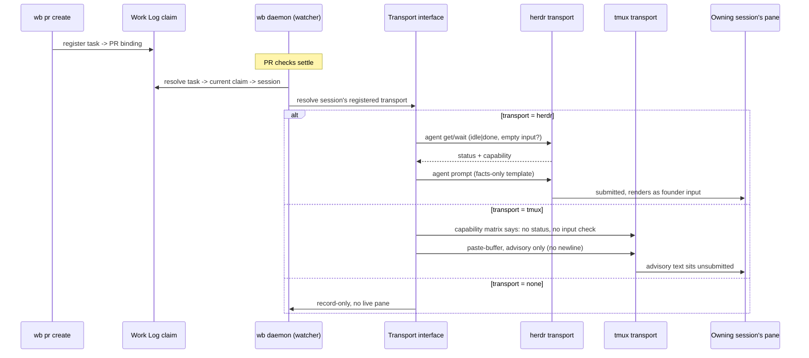

# Feature: Herdr Session Transport

> [SpecScore.**Studio**](https://specscore.studio): | [Explore](https://specscore.studio/app/github.com/sneat-dev/wb/spec/features/herdr-session-transport?op=explore) | [Edit](https://specscore.studio/app/github.com/sneat-dev/wb/spec/features/herdr-session-transport?op=edit) | [Ask question](https://specscore.studio/app/github.com/sneat-dev/wb/spec/features/herdr-session-transport?op=ask) | [Request change](https://specscore.studio/app/github.com/sneat-dev/wb/spec/features/herdr-session-transport?op=request-change) |
**Status:** Draft
**Source Ideas:** daemon-as-coordinator

## Summary

WB's session layer moves from a tmux-only terminal surface to a pluggable
transport, with **herdr as the default and tmux kept as an alternative**. One
transport interface carries session identity capture, session messaging,
move/park/resume, successor launch, and the daemon's own-PR wake delivery.
Herdr also supplies what tmux never could — live agent status and an
empty-input check — which is what lets the MVP wake flow (`daemon-as-coordinator`,
founder-agreed 2026-09-18) exist at all: register a task's PR at `wb pr create`,
resolve session and pane at delivery, and wake the owning session with a
facts-only message when its own pull request settles.

## Problem

"We switched from tmux to herdr," and WB's session layer did not switch with
it. Every production session code path — registration, `wb session message`,
`wb session move`/`receive`, `wb session park`/`resume`, successor launch, and
the courier boundary — is written directly against tmux (`internal/session*`,
`internal/sessionlaunch/tmux.go`, `internal/sessionmessage/tmux.go`,
`cmd/wb/session_*.go`, `internal/worktrees/session_*.go`; roughly 26
production files). None of it can see a herdr pane, so none of it can carry
the one capability herdr adds that tmux structurally cannot: knowing whether a
session is idle, working, blocked, or done, and whether its input box is
empty. Without that, the wake flow the founder already agreed to — "we already
have idea to use herdr to send messages to agents to wake them up and to
direct" — has no safe way to check its own delivery guards, on any transport.

The founder has not asked to drop tmux: "We should decide if we keep tmux as
an alternative or migrate to herdr," and then, weighing it, "For me I don't
need tmux but we build open product and some people can be attached to it."
So the fix is not a rewrite onto herdr; it is a transport boundary that lets
herdr be the default while tmux keeps working, unregressed, for whoever still
runs it.

## Behavior

### Identity capture

#### REQ: automatic-transport-identity-capture

`wb session register`, the session record it writes, and Work Log claims made
by that session MUST capture terminal transport identity automatically from
the process environment, with no flag required for the common case: the herdr
pane ID (`HERDR_PANE_ID`), the herdr workspace ID (`HERDR_WORKSPACE_ID`), and
the harness's own session ID (`CLAUDE_CODE_SESSION_ID` for Claude Code; the
Codex equivalent, when the running Codex build exposes one) MUST be captured
together as one identity, not as independently optional fields captured on
different paths.

#### REQ: identity-capture-outside-herdr

When `HERDR_PANE_ID` is absent, registration MUST fall back to today's tmux
identity (`TMUX` env var, or an explicit `--tmux-name`) and record transport
`tmux`. When neither herdr nor tmux identity is observable — a plain terminal,
a CI runner, a detached background process — registration MUST still succeed,
record transport `none`, and record only the harness session ID and machine.
Missing terminal identity MUST NOT refuse registration; it only narrows what
later delivery can address.

#### REQ: subagent-shares-parent-owner

Identity capture MUST treat an in-process subagent as sharing its parent's
identity, never as a second owner. Verified 2026-09-19 against a live Claude
Code subagent: its environment carried the identical `CLAUDE_PID`,
`CLAUDE_CODE_SESSION_ID`, and `HERDR_PANE_ID` as its parent process. WB MUST
NOT create a second session record, a second claim owner, or a second wake
target for a subagent; every claim-ownership check and every wake delivery
MUST resolve to the parent session.

### Pluggable terminal transport

The founder decided to keep both: "We should decide if we keep tmux as an
alternative or migrate to herdr," and then, "For me I don't need tmux but we
build open product and some people can be attached to it."

#### REQ: single-transport-interface

Every session code path that addresses a terminal — session messaging
(`wb session message`, `wb session send`), move and park/resume delivery,
successor launch, the courier delivery boundary, and the daemon wake's
paste-or-submit-into-pane path — MUST go through one Go transport interface.
No call site may branch on herdr-vs-tmux directly; that choice belongs to
transport selection (REQ:automatic-transport-selection,
REQ:explicit-transport-override), not to each call site.

#### REQ: two-transport-implementations

WB MUST ship exactly two implementations of that interface at this Feature's
completion: a **herdr** transport built on the `internal/herdr` adapter
(Plan Task 1, in progress in a separate lane), and a **tmux** transport that is
today's `internal/sessionlaunch`, `internal/sessionmessage`, and related tmux
code moved behind the interface with no behavior change.

#### REQ: automatic-transport-selection

Transport selection MUST be automatic by default: herdr when `HERDR_PANE_ID`
is set in the process environment; otherwise tmux when `TMUX` is set or the
session record carries a recorded tmux name; otherwise `none`.

#### REQ: explicit-transport-override

A `wb.yaml` `session.transport` setting, or an equivalent command flag, MUST
override automatic detection when present. An override MUST be validated
against the transports WB actually ships and MUST fail closed — refuse, not
silently fall back to automatic selection — when the named transport's
prerequisite (herdr socket, tmux binary) is not reachable.

#### REQ: selected-transport-recorded

The transport resolved for a session (herdr, tmux, or none) MUST be recorded
on that session's record alongside the identity fields from
REQ:automatic-transport-identity-capture, so later commands and
`wb session list` read it rather than re-detecting it.

#### REQ: transport-capability-matrix

WB MUST document, and its delivery logic MUST enforce, a capability matrix
naming what each transport supports: live agent status (idle / working /
blocked / done), an empty-input-box check, submit-vs-advisory delivery
(prompt-equivalent vs. send-keys-equivalent), and pane/workspace enumeration.
tmux supports **none** of the first two — it has no agent-status concept and
no way to inspect the pending input line. Wherever a capability the wake
flow's delivery guards depend on (idle/done state, empty input; see
REQ:delivery-guards-enforced-and-rechecked) is unavailable on the resolved
transport, WB MUST NOT perform a submitted (binding) delivery on that
transport. It MUST degrade to that transport's documented fallback — for
tmux, **advisory-only paste without submission, or record-only** — and MUST
NEVER submit a message it cannot guard.

#### REQ: none-transport-is-first-class

When the resolved transport is `none`, every session and wake code path MUST
treat that as a supported, expected outcome rather than an error: it records
the intended message or event and reports plainly that no live delivery
occurred, instead of failing the calling command.

#### REQ: tmux-parity-preserved

Moving the tmux code behind the transport interface MUST NOT change any
existing tmux-transport behavior relied on by `agent-session-move` and
`park-and-resume-agent-sessions`. Every existing tmux test MUST continue to
pass with only wiring changed, not behavior, and the Plan MUST add
characterization tests ahead of the move wherever coverage is currently thin,
so parity is proven rather than assumed.

### The MVP wake flow

Exactly the flow `daemon-as-coordinator` records as founder-agreed
(2026-09-18): "one flow, 'your PR has an outcome → your session wakes.'"

#### REQ: registration-at-pr-create

`wb pr create` MUST record the task-to-pull-request binding at creation time,
as it already does (sneat-dev/wb#601, landed). No pane, session, or transport
is registered at this point — only the task.

#### REQ: resolution-at-delivery

Session and pane resolution MUST happen at delivery time, not at
registration: task → the session currently holding the task's Work Log claim
→ that session's registered transport identity (its pane, for herdr). This
chain MUST be re-walked on every delivery attempt, so it reaches whoever holds
the claim now — surviving compaction, `/move`, and `/park`→`/pickup` since
registration.

#### REQ: delivery-guards-enforced-and-rechecked

Before any submitted (binding) delivery, WB MUST verify, and re-verify
immediately before sending, all of: the claim chain resolves to a live
session (a `/move` successor claim inherits the binding); that session
recorded its own native harness session ID and it still matches the
transport's live session ID for that pane; the session and the caller are on
the same machine; the transport reports the session `idle` or `done`; and,
where the resolved transport exposes it, the input box is empty. Any guard
failing at either check MUST cancel the delivery. Guards MUST NOT be checked
once and cached across the send — `working`/`blocked` holds delivery until the
next tick, never queues it on top of a half-typed human draft.

#### REQ: facts-only-templates

Every wake message MUST be built from a fixed, closed set of templates
carrying identifiers only — repository, PR number, check name (only when it
appears in the target's required-check ruleset, otherwise a count), SHA —
never a provider-authored title, body, comment, or log line. WB MUST NOT
provide a code path that formats arbitrary text into a submitted message.

#### REQ: prompt-restricted-to-own-pr-outcome

A submitted (binding) delivery MUST be used only for the one event class the
idea enumerates: the outcome of the session's **own** registered pull
request. This is the founder-approved (2026-09-18) extension of the binding
set to exactly one event class, and it MUST be enumerated in code, not made
configurable.

#### REQ: advisory-for-everything-else

Every other event class MUST be delivered advisory-only — paste without
submission — or record-only where the resolved transport cannot address the
session live. WB MUST NOT submit any event outside
REQ:prompt-restricted-to-own-pr-outcome.

#### REQ: daemon-message-not-approval-evidence

No WB verb may accept a daemon-originated wake message, or a transcript line
produced by one, as `--approved-by` or any other approval evidence. Command
help and skill documentation MUST state that a `[wb daemon]` line is a
notification, never an approval.

#### REQ: wake-visible-in-listings

An outstanding or delivered wake subscription MUST appear in
`wb session list` and `wb wait list`, naming the registered task, the target
pull request, and the last delivery outcome — so a wake leaves a trace beyond
the transcript line it produced.

### Directing agents (new proposal — not decided by the idea)

The founder's words include "to direct": a human, or the lead, sending an
instruction to a named agent's pane through WB. `daemon-as-coordinator` does
not specify this. Its binding set is drawn narrowly around one *automated*
event class, and its "authority laundering" analysis is about content an
attacker steers into a message the **daemon** composes and submits. A human
deliberately directing another pane through WB is a different risk in one
sense — the sender already holds the authority a submitted message would
carry — but it is not the same as the human typing into that pane themselves:
it is WB exposing a generic "write into another session's pane, optionally
submit" primitive, callable by anything that can call WB. That is exactly the
shape of capability the idea's authority-laundering section warns needs a
narrow, enumerated boundary, not a general one.

Nothing here is decided: not the command surface, not who may call it, not
whether it defaults to advisory or submitted delivery, and not whether it
gets the same visibility as REQ:wake-visible-in-listings. Every one of those
is an authority-boundary decision the idea did not make, so all of them are
recorded under Open Questions rather than as REQs.

### Supported herdr version and failure modes

Detection and version handling were exercised directly against the installed
herdr 0.9.1 while writing this Feature: `herdr --version`, `herdr --help`,
`herdr agent --help`, `herdr pane --help`, `herdr agent list`, and
`herdr pane current` (read-only per this lane's safety file). Sample JSON from
those two commands is the basis for REQ:herdr-version-detected-and-bounded and
belongs under `testdata` as fixtures, with the real session IDs in the sampled
output replaced by fakes.

#### REQ: herdr-version-detected-and-bounded

WB MUST detect the installed herdr version before relying on any herdr
transport call, and MUST record the version it detected. WB targets the
socket-API command surface read from herdr 0.9.1's own help output (`agent
list/get/prompt/send-keys/wait`, `pane current/list/get`). An older herdr
missing a command WB depends on, or a newer herdr whose JSON schema no longer
matches (an added, renamed, or retyped field WB's decoder rejects), MUST
produce an explicit, distinguishable failure — never a silent misparse that
returns wrong or empty data as if it were valid.

#### REQ: explicit-transport-failure-modes

Every herdr failure mode MUST surface a distinct, actionable message: herdr
binary not found on `PATH`; herdr socket unreachable (server not running,
stale socket path at `$HERDR_SOCKET_PATH`); herdr reachable but the target
pane or agent no longer exists (closed, moved, herdr restarted); and version
drift per REQ:herdr-version-detected-and-bounded. In every case except an
explicit override naming herdr, WB MUST fall back to whatever automatic
selection would produce with herdr unavailable (tmux, if applicable, else
`none`) rather than aborting the calling command outright. An explicit
override naming herdr (REQ:explicit-transport-override) refuses instead, per
that REQ.

## Architecture

## Acceptance Criteria

### AC: identity-captured-automatically-in-herdr

**Requirements:** herdr-session-transport#req:automatic-transport-identity-capture

Scenario: Register inside a herdr pane
Given `HERDR_PANE_ID`, `HERDR_WORKSPACE_ID`, and `CLAUDE_CODE_SESSION_ID` are
set in the process environment
When `wb session register` runs with no transport flags
Then the session record carries the pane ID, workspace ID, and harness
session ID together, and the resolved transport is herdr

### AC: identity-degrades-outside-herdr

**Requirements:** herdr-session-transport#req:identity-capture-outside-herdr

Scenario: Register with no herdr and no tmux
Given `HERDR_PANE_ID` and `TMUX` are both unset and no `--tmux-name` is given
When `wb session register` runs
Then registration succeeds, the resolved transport is `none`, and only the
harness session ID and machine are recorded

### AC: subagent-resolves-to-parent-owner

**Requirements:** herdr-session-transport#req:subagent-shares-parent-owner

Scenario: A subagent's wake resolves to its parent
Given a parent session registered with pane, workspace, and harness session
identity, and an in-process subagent sharing that same `CLAUDE_PID`,
`CLAUDE_CODE_SESSION_ID`, and `HERDR_PANE_ID`
When a claim-ownership check or a wake delivery resolves the owner
Then it resolves to the parent session's record, and no second session record
or wake target is created for the subagent

### AC: transport-selected-automatically

**Requirements:** herdr-session-transport#req:automatic-transport-selection, herdr-session-transport#req:selected-transport-recorded

Scenario: Automatic selection picks herdr over tmux
Given both `HERDR_PANE_ID` and `TMUX` are set
When transport selection runs with no explicit override
Then herdr is selected and recorded on the session, not tmux

### AC: explicit-override-fails-closed

**Requirements:** herdr-session-transport#req:explicit-transport-override

Scenario: Explicit tmux override with no tmux available
Given `wb.yaml` names `session.transport: tmux` and no `tmux` binary is on
`PATH`
When a session command resolves its transport
Then WB refuses with an actionable message and does not silently fall back to
herdr or `none`

### AC: tmux-never-delivers-unguarded

**Requirements:** herdr-session-transport#req:transport-capability-matrix

Scenario: A wake targets a tmux-transport session
Given the resolved transport for the owning session is tmux
When the daemon attempts the own-PR-outcome wake
Then WB never performs a submitted delivery on that session; it delivers
advisory-only (unsubmitted paste) or records the event only, and the
capability matrix is the documented reason why

### AC: none-transport-records-only

**Requirements:** herdr-session-transport#req:none-transport-is-first-class

Scenario: Wake target has no live transport
Given the owning session's resolved transport is `none`
When the daemon attempts a wake
Then WB records the event and reports no live delivery occurred, and the
calling command does not fail

### AC: tmux-behavior-is-unregressed

**Requirements:** herdr-session-transport#req:tmux-parity-preserved

Scenario: Existing tmux session-move and messaging tests still pass
Given the tmux code has moved behind the transport interface
When the existing `agent-session-move` and `park-and-resume-agent-sessions`
tmux test suites run
Then every test passes with unchanged observable behavior

### AC: own-pr-outcome-wakes-the-owner

**Requirements:** herdr-session-transport#req:registration-at-pr-create, herdr-session-transport#req:resolution-at-delivery, herdr-session-transport#req:prompt-restricted-to-own-pr-outcome, herdr-session-transport#req:facts-only-templates

Scenario: A registered PR's checks settle while the owner is idle
Given a task registered against a pull request at `wb pr create`, and the
session currently holding that task's claim is idle in a herdr pane with an
empty input box
When the daemon observes the pull request's checks settle
Then it delivers a facts-only, identifiers-only submitted message naming the
repository and PR number to that session's pane

### AC: guards-refuse-an-unsafe-wake

**Requirements:** herdr-session-transport#req:delivery-guards-enforced-and-rechecked

Scenario: The owner is mid-turn when the outcome arrives
Given the resolved owning session is `working`, or its input box is non-empty
When the daemon attempts delivery
Then WB cancels the delivery and holds it for the next tick, re-checking
state and input immediately before any later attempt

### AC: non-pr-events-stay-advisory

**Requirements:** herdr-session-transport#req:advisory-for-everything-else

Scenario: A non-own-PR event occurs
Given an event outside the enumerated own-PR-outcome class (e.g. a lane
conflict on another session's PR)
When the daemon would notify the owning session
Then delivery is advisory-only or record-only; WB never submits it

### AC: daemon-line-cannot-approve

**Requirements:** herdr-session-transport#req:daemon-message-not-approval-evidence

Scenario: An agent tries to cite a wake as approval
Given a delivered `[wb daemon]` wake message naming a PR outcome
When any WB verb evaluates `--approved-by` or equivalent approval evidence
Then the daemon message text is never accepted as that evidence

### AC: wake-subscription-is-visible

**Requirements:** herdr-session-transport#req:wake-visible-in-listings

Scenario: List sessions and waits with an outstanding wake
Given a task is registered against a pull request and no outcome has arrived
yet
When `wb session list` or `wb wait list` runs
Then the outstanding subscription appears, naming the task and target PR

### AC: missing-herdr-binary-fails-explicitly

**Requirements:** herdr-session-transport#req:explicit-transport-failure-modes

Scenario: herdr is not installed
Given `herdr` is not found on `PATH` and automatic selection would otherwise
choose it
When a session command resolves its transport
Then WB reports a distinct "herdr binary not found" failure and falls back to
tmux or `none` per automatic selection, unless herdr was explicitly named

### AC: unreachable-socket-fails-explicitly

**Requirements:** herdr-session-transport#req:explicit-transport-failure-modes

Scenario: herdr is installed but its server is not running
Given the herdr binary exists but `$HERDR_SOCKET_PATH` is not accepting
connections
When a session command resolves its transport
Then WB reports a distinct "herdr socket unreachable" failure, separate from
"binary not found"

### AC: version-drift-is-detected

**Requirements:** herdr-session-transport#req:herdr-version-detected-and-bounded

Scenario: An incompatible herdr JSON schema is returned
Given a fake herdr on the test `PATH` reports a version or an `agent list` /
`pane current` shape WB's decoder does not recognize
When WB detects the herdr version or decodes its output
Then WB reports a distinct version-drift failure rather than silently
returning partial or wrong data

## Rehearse Integration

Every acceptance criterion above has a deterministic CLI, environment,
filesystem, or fake-transport surface. Tests use an injected exec seam or a
fake `herdr` script on a temporary `PATH`, written with the Write tool per
this lane's safety file, and unset or override `HERDR_*` so no test can reach
the real herdr socket or the founder's live panes. Sample JSON captured from
the real, read-only `herdr agent list` and `herdr pane current` (session IDs
replaced by fakes) seeds the fixtures under `testdata/`.

## Not Doing

- Implementing the herdr socket protocol directly; WB only shells out to the
  `herdr` CLI, the way it already shells out to `gh`.
- A channel-server or stdin-owned coordinator process (the idea's longer-term
  typed-event vocabulary); this Feature is the MVP wake flow only.
- Any autonomous merge behavior beyond what `wb pr land` already does.
- The "directing agents" command surface itself — proposed and discussed above,
  but not specified as a REQ pending founder decisions in Open Questions.
- Relaying provider-authored text (titles, bodies, comments, logs) into any
  submitted message, on any transport.
- Supporting a terminal multiplexer other than herdr or tmux.

## Open Questions

- What is the command surface for a human or the lead to direct a named
  agent's pane through WB — name, target addressing (session ID, pane ID, or
  task), and does it default to advisory or submitted delivery? This widens
  the authority boundary `daemon-as-coordinator` scoped narrowly to one
  automated event class, so it needs founder approval before it becomes a REQ.
- Should a directing-agent call be restricted to the founder's own session (or
  an equivalent human-present check), so WB does not become a second, wider
  authority-laundering surface reachable by any process that can call WB?
- Should a directed message get the same visibility guarantee as
  REQ:wake-visible-in-listings, so a directed instruction leaves the same kind
  of trace a daemon wake does?
- The Codex equivalent of `CLAUDE_CODE_SESSION_ID` was not observed in this
  session (no Codex process was running to inspect); REQ:automatic-transport-identity-capture
  assumes one exists "when the running Codex build exposes one" and needs
  confirming against a live Codex session before implementation.
- Should WB pin a single supported herdr version, or a range? This Feature
  only requires that drift be detected and explicit (REQ:herdr-version-detected-and-bounded);
  it does not set an update or compatibility policy.

---
*This document follows the https://specscore.md/feature-specification*
