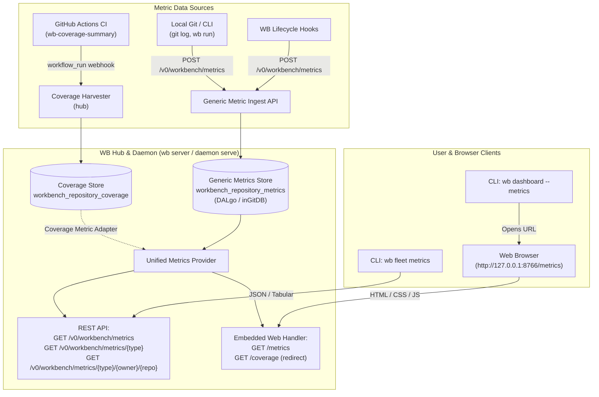

# Plan: Generic Fleet Metrics & Web Dashboard for `wb`

**Status:** Implemented
**Source Feature:** fleet-quality
**Date:** 2026-09-26
**Owner:** alex
**Supersedes:** —

---

## 1. Summary

Add an interactive, zero-dependency web dashboard to `wb server` (`wb daemon serve` / `wb hub`) to visualize quality and engineering velocity across repositories and packages.

The architecture is deliberately **generic**: rather than hardcoding a coverage-only UI, the server provides a generalized **Fleet Metrics Framework** capable of storing, querying, and rendering any multi-dimensional repository metric (e.g. test coverage, commits per day, PR velocity, build duration, lint health). Test coverage serves as the flagship metric, presenting fleet-wide totals, per-repository status, and an expandable hierarchical breakdown per Go package.

The implementation uses **DALgo** with the local **inGitDB** engine (`~/.wb/hub`) for pilot testing, requires zero external Node.js/pnpm build steps for standard CLI/daemon installations, and is architected for **100% statement test coverage** on all newly added code.

---

## 2. Founder Decisions & Constraints

1. **Web UI Hosting**: **Pure-Go Embedded HTML/JS in `wb server`**. Zero Node/pnpm dependency required for operators running `wb daemon serve` / `wb server`. Works out-of-the-box in pure Go binaries and is 100% testable with standard Go `httptest`.
2. **Generality**: **Generic Metric Record Envelope**. A unified data model (`RepositoryMetric`) with scalar values, units, threshold rules, and arbitrary `Dimensions` (e.g. packages for coverage, dates/authors for commits).
3. **Coverage Integration**: **Zero-Migration Adapter**. Seamlessly maps existing `workbench_repository_coverage` records into the generic `test_coverage` metric dimension model without data migration.
4. **Pilot Storage Engine**: **Local `inGitDB` via DALgo**. Validates persistence in `~/.wb/hub` using `dalgo2ingitdb` without requiring GCP Cloud Run or Firestore infrastructure up front.
5. **Test Coverage Scope**: **100% on Newly Added Code Only**. Strict 100% statement coverage on all new packages/files (`hub/metrics/`, `internal/dashboard/metrics.go`). Legacy debt is intentionally untouched.

---

## 3. End-to-End Architecture



---

## 4. Generic Metric Schema & Data Models

### 4.1 Metric Type Definition

Defines the semantic behavior, formatting, and health thresholds for a category of metric:

- `Type`: unique string identifier (e.g. `test_coverage`, `commits_per_day`).
- `Title`: human-readable title (e.g. `Test Coverage`, `Commits Per Day`).
- `Description`: brief explanation of the metric.
- `Unit`: measurement unit (e.g. `%`, `commits/day`, `ms`).
- `Format`: formatting rule (`percentage`, `integer`, `float`, `duration`).
- `DimensionLabel`: label for breakdown items (`Package`, `Day`, `Author`).
- `GoodThreshold`: threshold boundary for `passed` / green.
- `WarnThreshold`: threshold boundary for `warning` / yellow.
- `HigherIsBetter`: boolean indicating whether higher numbers are desirable.

### 4.2 Generic Metric Record

Represents a measured snapshot for a repository, including top-level scalars and hierarchical breakdown:

- `Repository`: repository slug (e.g. `sneat-dev/wb`).
- `Owner`: organization or user (e.g. `sneat-dev`).
- `Name`: repository name (e.g. `wb`).
- `MetricType`: type identifier matching a `MetricTypeDefinition`.
- `ReportedAt`: timestamp of the report.
- `Ref`: Git reference (e.g. `refs/heads/main`).
- `SHA`: Git commit SHA.
- `Value`: primary scalar float.
- `FormattedValue`: human-readable representation (e.g. `87.5%`).
- `Status`: evaluation status (`passed`, `warning`, `failed`, `neutral`).
- `Metadata`: arbitrary key-value payload (e.g. workflow run URL, statements count).
- `Dimensions`: ordered slice of `MetricDimension` breakdown items.

Each `MetricDimension` item represents a slice along the declared dimension (e.g., a Go package or date):
- `Name`: identifier of the dimension item (e.g. `hub/narrate`, `2026-09-26`).
- `Value`: scalar float.
- `FormattedValue`: formatted string representation.
- `Status`: status indicator (`passed`, `warning`, `failed`).
- `Details`: granular dictionary (e.g. statements count and covered statements).

---

## 5. DALgo Persistence & Collection Schema

1. **Collection Path**:
   - Collection name: `workbench_repository_metrics`
   - Document ID: composite key `{metric_type}___{owner}___{name}`
   - Registered in `hub/collections.go`: `repositoryMetricsCollection = "workbench_repository_metrics"`
2. **Storage Engines**:
   - **Local Pilot**: In `hubconfig`, `cfg.Store.Engine == "ingitdb"` stores JSON/YAML documents under `~/.wb/hub/workbench_repository_metrics/`.
   - **Unit Testing**: `dalgo2memory` in-memory database adapter for hermetic tests.
   - **Hosted / Cloud**: Firestore adapter using identical DALgo record interfaces.
3. **Coverage Adapter**:
   - A `CoverageMetricAdapter` exposes existing records from `workbench_repository_coverage` as `test_coverage` metrics.
   - Maps `Percentage` to `Value` and `FormattedValue`.
   - Maps `summary.Packages` to `[]MetricDimension` where `Name` is the package path and `Value` is the package percentage.

---

## 6. Web Dashboard UI Design

The web interface is served directly by the Go server at `/metrics` (with `/coverage` redirecting to `/metrics?type=test_coverage`).

1. **Header & Navigation**:
   - Title: `WB Metrics · Fleet Quality & Velocity`
   - Navigation links: `Operations Dashboard` | `Metrics`
   - **Metric Tabs**: Filter pill buttons (`[ Test Coverage ]`, `[ Commits Per Day ]`). Clicking a tab updates the active metric without a full page reload.
   - Search box: Instant client-side text filtering for repository and package names.
2. **Fleet Overview KPI Cards**:
   - `Total Repositories`: Count of monitored repositories.
   - `Fleet Average`: Weighted coverage percentage or aggregate velocity.
   - `Passing / Healthy`: Count of repositories with `status: passed`.
   - `Needs Attention`: Count of repositories below threshold (`status: warning` or `failed`).
3. **Repository Summary Table**:
   - Columns: `Repository`, `Primary Value` (progress bar + badge), `Details`, `Branch & Commit`, `Last Reported`, `Action` (expand toggle).
4. **Expandable Per-Package Breakdown**:
   - Expanding a row opens a nested sub-table:
     - Search filter: "Filter packages...".
     - Columns: `Package`, `Coverage` (progress bar + text), `Statements` (covered / total), `Status` dot.
     - Sortable by lowest coverage first to immediately highlight gaps.
5. **Zero-Dependency Styling**:
   - Zero external CSS/JS libraries (pure semantic HTML5 + lightweight inline CSS + vanilla JS).
   - Automatic Dark/Light mode support matching `internal/dashboard`.

---

## 7. HTTP API Specification

| Method | Path | Description | Access Control |
|---|---|---|---|
| `GET` | `/metrics` | Interactive HTML Metrics Dashboard | Public / Loopback |
| `GET` | `/coverage` | Convenience shortcut; redirects to `/metrics?type=test_coverage` | Public / Loopback |
| `GET` | `/v0/workbench/metrics/types` | List registered metric types & metadata | Viewer / Bearer |
| `GET` | `/v0/workbench/metrics` | List latest repository metrics (`?type=...`) | Viewer / Bearer |
| `GET` | `/v0/workbench/metrics/{owner}/{repo}` | Get detailed metric with package breakdown | Viewer / Bearer |
| `POST` | `/v0/workbench/metrics` | Ingest/publish a generic repository metric | Bearer / Local |

---

## Tasks

### Task 1: Generic Metrics Domain & DALgo Store

**Id:** task-1
**Verifies:** fleet-quality#ac:fleet-metrics-web-dashboard
**Status:** complete

- Define generic metric structures (`MetricTypeDefinition`, `RepositoryMetric`, `MetricDimension`).
- Implement `RepositoryMetricsStore` using DALgo (`hub/repository_metrics_store.go`).
- Register `workbench_repository_metrics` collection in `hub/collections.go`.
- Implement `CoverageMetricAdapter` bridging `StoredRepositoryCoverage` into `RepositoryMetric`.
- Write unit tests in `hub/repository_metrics_store_test.go` with 100% statement coverage.

### Task 2: Hub Generic Metrics REST API

**Id:** task-2
**Verifies:** fleet-quality#ac:fleet-metrics-web-dashboard
**Depends-On:** task-1
**Status:** complete

- Implement `/v0/workbench/metrics`, `/v0/workbench/metrics/types`, and `/v0/workbench/metrics/{owner}/{repo}` endpoints in `hub/http.go`.
- Support JSON decoding, validation, and authorization matching existing Hub conventions.
- Write unit tests in `hub/metrics_http_test.go` with 100% statement coverage.

### Task 3: Summary Home Page & Metrics Dashboard UI

**Id:** task-3
**Verifies:** fleet-quality#ac:fleet-metrics-web-dashboard
**Depends-On:** task-1, task-2
**Status:** complete

- Create pure-Go embedded HTML/CSS/JS dashboard in `internal/dashboard/metrics_page.go`.
- Render summary home page displaying:
  - Repositories with least coverage (sorted ascending by percentage).
  - Most active repositories (sorted by latest activity/commits).
  - Active and abandoned worktrees inventory with status badges.
- Provide per-package coverage drilldown with interactive filtering and progress bars.
- Implement `GET /metrics` and redirect `GET /coverage` in `internal/dashboard/dashboard.go`.
- Add navigation link between "Operations" and "Metrics & Coverage".
- Write unit tests in `internal/dashboard/metrics_test.go` with 100% statement coverage.

### Task 4: CLI Integration

**Id:** task-4
**Verifies:** fleet-quality#ac:fleet-metrics-web-dashboard
**Depends-On:** task-3
**Status:** complete

- Add `--metrics` flag to `wb dashboard` to open `/metrics`.
- Add `--coverage` flag to `wb dashboard` to open `/coverage`.
- Wire `Coverage` and `Metrics` stores into `wb daemon serve` (`cmd/wb/daemon_hub.go`).
- Write unit tests in `cmd/wb/dashboard_test.go`.

## 9. 100% Test Coverage Strategy for New Code

1. **Strict Code Boundary**:
   - All new logic will reside in new, dedicated files:
     - `hub/repository_metrics_store.go` & `hub/repository_metrics_store_test.go`
     - `hub/metrics_http.go` & `hub/metrics_http_test.go`
     - `internal/dashboard/metrics.go` & `internal/dashboard/metrics_test.go`
   - Existing legacy files are only touched for clean registration hooks (`NewServeMux` registration, collection slice).
2. **Deterministic Scenarios**:
   - Empty metrics list, single metric, multiple metrics.
   - Good threshold, warning threshold, failing threshold.
   - Coverage with 0 packages, coverage with 50 packages.
   - Formatting checks: percentage, integer, float, duration.
   - Error cases: bad JSON payload, missing repo, unauthorized viewer, storage failure.
3. **Verification Command**:
   ```bash
   go test -v -coverprofile=coverage_new.out ./hub ./internal/dashboard
   go tool cover -func=coverage_new.out | grep -E "(metrics|repository_metrics)"
   ```
   Must display `100.0%` for all newly added functions.

## 10. Acceptance Criteria

1. Navigating to `http://127.0.0.1:8766/metrics` or `http://127.0.0.1:8766/coverage` in a browser displays the responsive metrics dashboard.
2. The dashboard displays all repositories with harvested test coverage, showing total statements, covered statements, and percentage with color-coded status badges.
3. Clicking on a repository expands its per-package coverage table, allowing sorting and searching across Go packages.
4. The backend API (`GET /v0/workbench/metrics`) accepts generic metrics (such as `commits_per_day` or arbitrary JSON dimensions) and persists them via DALgo.
5. Storage defaults to local `inGitDB` in `~/.wb/hub` during pilot testing.
6. `specscore spec lint` passes with 0 violations.
7. All newly written Go code has 100.0% statement test coverage verified by `go test -coverprofile`.

## Deferred AC Coverage

- fleet-quality#ac:truthful-fleet-coverage — verified by existing local fleet coverage test suite
- fleet-quality#ac:complete-conventional-verification — verified by existing verification test suite
- fleet-quality#ac:exact-graduation-receipt — verified by existing graduation receipt test suite
- fleet-quality#ac:instant-remote-ci-coverage — verified by existing remote CI coverage test suite

---
*This document follows the https://specscore.md/plan-specification*
